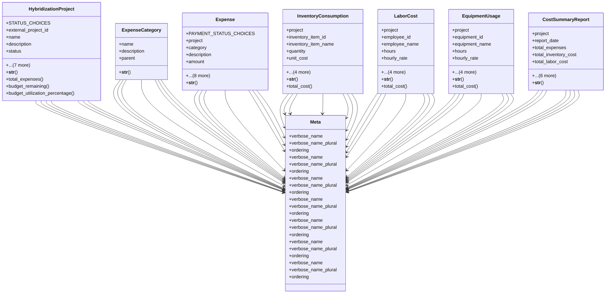

# agricultural_modules.seed_hybridization.cost_tracking_models

## Imports
- django.conf
- django.db
- django.utils.translation

## Classes
- HybridizationProject
  - attr: `STATUS_CHOICES`
  - attr: `external_project_id`
  - attr: `name`
  - attr: `description`
  - attr: `status`
  - attr: `start_date`
  - attr: `end_date`
  - attr: `actual_end_date`
  - attr: `budget`
  - attr: `created_by`
  - attr: `created_at`
  - attr: `updated_at`
  - method: `__str__`
  - method: `total_expenses`
  - method: `budget_remaining`
  - method: `budget_utilization_percentage`
- ExpenseCategory
  - attr: `name`
  - attr: `description`
  - attr: `parent`
  - method: `__str__`
- Expense
  - attr: `PAYMENT_STATUS_CHOICES`
  - attr: `project`
  - attr: `category`
  - attr: `description`
  - attr: `amount`
  - attr: `date`
  - attr: `payment_status`
  - attr: `reference_number`
  - attr: `notes`
  - attr: `created_by`
  - attr: `approved_by`
  - attr: `created_at`
  - attr: `updated_at`
  - method: `__str__`
- InventoryConsumption
  - attr: `project`
  - attr: `inventory_item_id`
  - attr: `inventory_item_name`
  - attr: `quantity`
  - attr: `unit_cost`
  - attr: `date`
  - attr: `notes`
  - attr: `created_by`
  - attr: `created_at`
  - method: `__str__`
  - method: `total_cost`
- LaborCost
  - attr: `project`
  - attr: `employee_id`
  - attr: `employee_name`
  - attr: `hours`
  - attr: `hourly_rate`
  - attr: `date`
  - attr: `description`
  - attr: `created_by`
  - attr: `created_at`
  - method: `__str__`
  - method: `total_cost`
- EquipmentUsage
  - attr: `project`
  - attr: `equipment_id`
  - attr: `equipment_name`
  - attr: `hours`
  - attr: `hourly_rate`
  - attr: `date`
  - attr: `notes`
  - attr: `created_by`
  - attr: `created_at`
  - method: `__str__`
  - method: `total_cost`
- CostSummaryReport
  - attr: `project`
  - attr: `report_date`
  - attr: `total_expenses`
  - attr: `total_inventory_cost`
  - attr: `total_labor_cost`
  - attr: `total_equipment_cost`
  - attr: `grand_total`
  - attr: `budget_utilization_percentage`
  - attr: `notes`
  - attr: `created_by`
  - attr: `created_at`
  - method: `__str__`
- Meta
  - attr: `verbose_name`
  - attr: `verbose_name_plural`
  - attr: `ordering`
- Meta
  - attr: `verbose_name`
  - attr: `verbose_name_plural`
  - attr: `ordering`
- Meta
  - attr: `verbose_name`
  - attr: `verbose_name_plural`
  - attr: `ordering`
- Meta
  - attr: `verbose_name`
  - attr: `verbose_name_plural`
  - attr: `ordering`
- Meta
  - attr: `verbose_name`
  - attr: `verbose_name_plural`
  - attr: `ordering`
- Meta
  - attr: `verbose_name`
  - attr: `verbose_name_plural`
  - attr: `ordering`
- Meta
  - attr: `verbose_name`
  - attr: `verbose_name_plural`
  - attr: `ordering`

## Functions
- __str__
- total_expenses
- budget_remaining
- budget_utilization_percentage
- __str__
- __str__
- __str__
- total_cost
- __str__
- total_cost
- __str__
- total_cost
- __str__

## Class Diagram

