# agricultural_modules.seed_hybridization.cost_tracking_serializers

## Imports
- cost_tracking_models
- rest_framework

## Classes
- ExpenseCategorySerializer
- ExpenseSerializer
  - attr: `category_name`
  - attr: `created_by_name`
  - attr: `approved_by_name`
  - method: `get_category_name`
  - method: `get_created_by_name`
  - method: `get_approved_by_name`
- InventoryConsumptionSerializer
  - attr: `inventory_item_name`
  - attr: `total_cost`
  - attr: `created_by_name`
  - method: `get_inventory_item_name`
  - method: `get_total_cost`
  - method: `get_created_by_name`
- LaborCostSerializer
  - attr: `employee_name`
  - attr: `total_cost`
  - attr: `created_by_name`
  - method: `get_employee_name`
  - method: `get_total_cost`
  - method: `get_created_by_name`
- EquipmentUsageSerializer
  - attr: `equipment_name`
  - attr: `total_cost`
  - attr: `created_by_name`
  - method: `get_equipment_name`
  - method: `get_total_cost`
  - method: `get_created_by_name`
- CostSummaryReportSerializer
  - attr: `project_name`
  - attr: `created_by_name`
  - method: `get_project_name`
  - method: `get_created_by_name`
- HybridizationProjectSerializer
  - attr: `total_expenses`
  - attr: `budget_remaining`
  - attr: `budget_utilization_percentage`
  - attr: `created_by_name`
  - method: `get_total_expenses`
  - method: `get_budget_remaining`
  - method: `get_budget_utilization_percentage`
  - method: `get_created_by_name`
- HybridizationProjectDetailSerializer
  - attr: `expenses`
  - attr: `inventory_consumptions`
  - attr: `labor_costs`
  - attr: `equipment_usages`
  - attr: `cost_reports`
- ProjectCostSummarySerializer
  - attr: `project`
  - attr: `total_expenses`
  - attr: `inventory_costs`
  - attr: `labor_costs`
  - attr: `equipment_costs`
  - attr: `grand_total`
  - attr: `budget`
  - attr: `budget_remaining`
  - attr: `budget_utilization`
- Meta
  - attr: `model`
  - attr: `fields`
- Meta
  - attr: `model`
  - attr: `fields`
- Meta
  - attr: `model`
  - attr: `fields`
- Meta
  - attr: `model`
  - attr: `fields`
- Meta
  - attr: `model`
  - attr: `fields`
- Meta
  - attr: `model`
  - attr: `fields`
- Meta
  - attr: `model`
  - attr: `fields`
- Meta
  - attr: `fields`

## Functions
- get_category_name
- get_created_by_name
- get_approved_by_name
- get_inventory_item_name
- get_total_cost
- get_created_by_name
- get_employee_name
- get_total_cost
- get_created_by_name
- get_equipment_name
- get_total_cost
- get_created_by_name
- get_project_name
- get_created_by_name
- get_total_expenses
- get_budget_remaining
- get_budget_utilization_percentage
- get_created_by_name

## Class Diagram

```mermaid
classDiagram
    class ExpenseCategorySerializer {
    }
    class ExpenseSerializer {
        +category_name
        +created_by_name
        +approved_by_name
        +get_category_name()
        +get_created_by_name()
        +get_approved_by_name()
    }
    class InventoryConsumptionSerializer {
        +inventory_item_name
        +total_cost
        +created_by_name
        +get_inventory_item_name()
        +get_total_cost()
        +get_created_by_name()
    }
    class LaborCostSerializer {
        +employee_name
        +total_cost
        +created_by_name
        +get_employee_name()
        +get_total_cost()
        +get_created_by_name()
    }
    class EquipmentUsageSerializer {
        +equipment_name
        +total_cost
        +created_by_name
        +get_equipment_name()
        +get_total_cost()
        +get_created_by_name()
    }
    class CostSummaryReportSerializer {
        +project_name
        +created_by_name
        +get_project_name()
        +get_created_by_name()
    }
    class HybridizationProjectSerializer {
        +total_expenses
        +budget_remaining
        +budget_utilization_percentage
        +created_by_name
        +get_total_expenses()
        +get_budget_remaining()
        +get_budget_utilization_percentage()
        +get_created_by_name()
    }
    class HybridizationProjectDetailSerializer {
        +expenses
        +inventory_consumptions
        +labor_costs
        +equipment_usages
        +cost_reports
    }
    class ProjectCostSummarySerializer {
        +project
        +total_expenses
        +inventory_costs
        +labor_costs
        +equipment_costs
        +... (4 more)
    }
    class Meta {
        +model
        +fields
    }
    class Meta {
        +model
        +fields
    }
    class Meta {
        +model
        +fields
    }
    class Meta {
        +model
        +fields
    }
    class Meta {
        +model
        +fields
    }
    class Meta {
        +model
        +fields
    }
    class Meta {
        +model
        +fields
    }
    class Meta {
        +fields
    }
    ExpenseCategorySerializer --> Meta
    ExpenseCategorySerializer --> Meta
    ExpenseCategorySerializer --> Meta
    ExpenseCategorySerializer --> Meta
    ExpenseCategorySerializer --> Meta
    ExpenseCategorySerializer --> Meta
    ExpenseCategorySerializer --> Meta
    ExpenseCategorySerializer --> Meta
    ExpenseSerializer --> Meta
    ExpenseSerializer --> Meta
    ExpenseSerializer --> Meta
    ExpenseSerializer --> Meta
    ExpenseSerializer --> Meta
    ExpenseSerializer --> Meta
    ExpenseSerializer --> Meta
    ExpenseSerializer --> Meta
    InventoryConsumptionSerializer --> Meta
    InventoryConsumptionSerializer --> Meta
    InventoryConsumptionSerializer --> Meta
    InventoryConsumptionSerializer --> Meta
    InventoryConsumptionSerializer --> Meta
    InventoryConsumptionSerializer --> Meta
    InventoryConsumptionSerializer --> Meta
    InventoryConsumptionSerializer --> Meta
    LaborCostSerializer --> Meta
    LaborCostSerializer --> Meta
    LaborCostSerializer --> Meta
    LaborCostSerializer --> Meta
    LaborCostSerializer --> Meta
    LaborCostSerializer --> Meta
    LaborCostSerializer --> Meta
    LaborCostSerializer --> Meta
    EquipmentUsageSerializer --> Meta
    EquipmentUsageSerializer --> Meta
    EquipmentUsageSerializer --> Meta
    EquipmentUsageSerializer --> Meta
    EquipmentUsageSerializer --> Meta
    EquipmentUsageSerializer --> Meta
    EquipmentUsageSerializer --> Meta
    EquipmentUsageSerializer --> Meta
    CostSummaryReportSerializer --> Meta
    CostSummaryReportSerializer --> Meta
    CostSummaryReportSerializer --> Meta
    CostSummaryReportSerializer --> Meta
    CostSummaryReportSerializer --> Meta
    CostSummaryReportSerializer --> Meta
    CostSummaryReportSerializer --> Meta
    CostSummaryReportSerializer --> Meta
    HybridizationProjectSerializer --> Meta
    HybridizationProjectSerializer --> Meta
    HybridizationProjectSerializer --> Meta
    HybridizationProjectSerializer --> Meta
    HybridizationProjectSerializer --> Meta
    HybridizationProjectSerializer --> Meta
    HybridizationProjectSerializer --> Meta
    HybridizationProjectSerializer --> Meta
    HybridizationProjectDetailSerializer --> Meta
    HybridizationProjectDetailSerializer --> Meta
    HybridizationProjectDetailSerializer --> Meta
    HybridizationProjectDetailSerializer --> Meta
    HybridizationProjectDetailSerializer --> Meta
    HybridizationProjectDetailSerializer --> Meta
    HybridizationProjectDetailSerializer --> Meta
    HybridizationProjectDetailSerializer --> Meta
    ProjectCostSummarySerializer --> Meta
    ProjectCostSummarySerializer --> Meta
    ProjectCostSummarySerializer --> Meta
    ProjectCostSummarySerializer --> Meta
    ProjectCostSummarySerializer --> Meta
    ProjectCostSummarySerializer --> Meta
    ProjectCostSummarySerializer --> Meta
    ProjectCostSummarySerializer --> Meta
```

