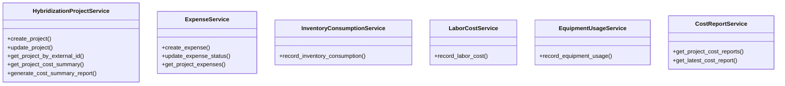

# agricultural_modules.seed_hybridization.cost_tracking_services

## Imports
- assets.models
- cost_tracking_models
- decimal
- django.core.exceptions
- django.db
- django.db.models
- django.utils
- hr.models
- inventory.models
- inventory.services

## Classes
- HybridizationProjectService
  - method: `create_project`
  - method: `update_project`
  - method: `get_project_by_external_id`
  - method: `get_project_cost_summary`
  - method: `generate_cost_summary_report`
- ExpenseService
  - method: `create_expense`
  - method: `update_expense_status`
  - method: `get_project_expenses`
- InventoryConsumptionService
  - method: `record_inventory_consumption`
- LaborCostService
  - method: `record_labor_cost`
- EquipmentUsageService
  - method: `record_equipment_usage`
- CostReportService
  - method: `get_project_cost_reports`
  - method: `get_latest_cost_report`

## Functions
- create_project
- update_project
- get_project_by_external_id
- get_project_cost_summary
- generate_cost_summary_report
- create_expense
- update_expense_status
- get_project_expenses
- record_inventory_consumption
- record_labor_cost
- record_equipment_usage
- get_project_cost_reports
- get_latest_cost_report

## Class Diagram

