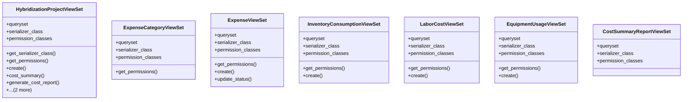

# agricultural_modules.seed_hybridization.cost_tracking_views

## Imports
- cost_tracking_models
- cost_tracking_serializers
- cost_tracking_services
- django.db
- django.utils
- permissions
- rest_framework
- rest_framework.decorators
- rest_framework.response

## Classes
- HybridizationProjectViewSet
  - attr: `queryset`
  - attr: `serializer_class`
  - attr: `permission_classes`
  - method: `get_serializer_class`
  - method: `get_permissions`
  - method: `create`
  - method: `cost_summary`
  - method: `generate_cost_report`
  - method: `expenses`
  - method: `cost_reports`
- ExpenseCategoryViewSet
  - attr: `queryset`
  - attr: `serializer_class`
  - attr: `permission_classes`
  - method: `get_permissions`
- ExpenseViewSet
  - attr: `queryset`
  - attr: `serializer_class`
  - attr: `permission_classes`
  - method: `get_permissions`
  - method: `create`
  - method: `update_status`
- InventoryConsumptionViewSet
  - attr: `queryset`
  - attr: `serializer_class`
  - attr: `permission_classes`
  - method: `get_permissions`
  - method: `create`
- LaborCostViewSet
  - attr: `queryset`
  - attr: `serializer_class`
  - attr: `permission_classes`
  - method: `get_permissions`
  - method: `create`
- EquipmentUsageViewSet
  - attr: `queryset`
  - attr: `serializer_class`
  - attr: `permission_classes`
  - method: `get_permissions`
  - method: `create`
- CostSummaryReportViewSet
  - attr: `queryset`
  - attr: `serializer_class`
  - attr: `permission_classes`

## Functions
- get_serializer_class
- get_permissions
- create
- cost_summary
- generate_cost_report
- expenses
- cost_reports
- get_permissions
- get_permissions
- create
- update_status
- get_permissions
- create
- get_permissions
- create
- get_permissions
- create

## Class Diagram

