# agricultural_modules.seed_hybridization.merged.admin

## Imports
- django.contrib
- models

## Classes
- PlantVarietyAdmin
  - attr: `list_display`
  - attr: `list_filter`
  - attr: `search_fields`
  - attr: `readonly_fields`
  - attr: `fieldsets`
- HybridVarietyInline
  - attr: `model`
  - attr: `extra`
  - attr: `readonly_fields`
  - attr: `fields`
  - attr: `can_delete`
  - attr: `show_change_link`
- HybridizationSimulationAdmin
  - attr: `list_display`
  - attr: `list_filter`
  - attr: `search_fields`
  - attr: `readonly_fields`
  - attr: `inlines`
  - attr: `fieldsets`
  - attr: `filter_horizontal`
- HybridVarietyAdmin
  - attr: `list_display`
  - attr: `list_filter`
  - attr: `search_fields`
  - attr: `readonly_fields`
  - attr: `fieldsets`
  - attr: `filter_horizontal`
- ExternalApiRequestLogAdmin
  - attr: `list_display`
  - attr: `list_filter`
  - attr: `search_fields`
  - attr: `readonly_fields`
  - attr: `fieldsets`
- HybridizationExperimentInline
  - attr: `model`
  - attr: `extra`
  - attr: `fields`
  - attr: `show_change_link`
- HybridizationProjectAdmin
  - attr: `list_display`
  - attr: `list_filter`
  - attr: `search_fields`
  - attr: `readonly_fields`
  - attr: `inlines`
  - attr: `fieldsets`
  - attr: `filter_horizontal`
- HybridizationExperimentAdmin
  - attr: `list_display`
  - attr: `list_filter`
  - attr: `search_fields`
  - attr: `readonly_fields`
  - attr: `fieldsets`
  - attr: `filter_horizontal`

## Class Diagram

```mermaid
classDiagram
    class PlantVarietyAdmin {
        +list_display
        +list_filter
        +search_fields
        +readonly_fields
        +fieldsets
    }
    class HybridVarietyInline {
        +model
        +extra
        +readonly_fields
        +fields
        +can_delete
        +... (1 more)
    }
    class HybridizationSimulationAdmin {
        +list_display
        +list_filter
        +search_fields
        +readonly_fields
        +inlines
        +... (2 more)
    }
    class HybridVarietyAdmin {
        +list_display
        +list_filter
        +search_fields
        +readonly_fields
        +fieldsets
        +... (1 more)
    }
    class ExternalApiRequestLogAdmin {
        +list_display
        +list_filter
        +search_fields
        +readonly_fields
        +fieldsets
    }
    class HybridizationExperimentInline {
        +model
        +extra
        +fields
        +show_change_link
    }
    class HybridizationProjectAdmin {
        +list_display
        +list_filter
        +search_fields
        +readonly_fields
        +inlines
        +... (2 more)
    }
    class HybridizationExperimentAdmin {
        +list_display
        +list_filter
        +search_fields
        +readonly_fields
        +fieldsets
        +... (1 more)
    }
```

