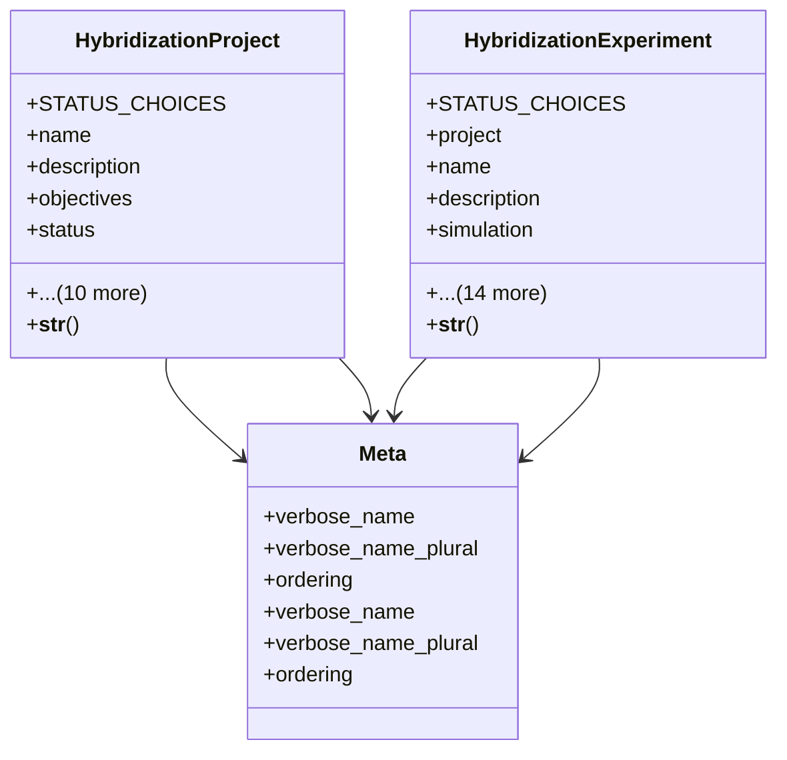

# agricultural_modules.seed_hybridization.merged.models

## Imports
- django.conf
- django.db
- django.utils
- django.utils.translation
- models

## Classes
- HybridizationProject
  - attr: `STATUS_CHOICES`
  - attr: `name`
  - attr: `description`
  - attr: `objectives`
  - attr: `status`
  - attr: `start_date`
  - attr: `end_date`
  - attr: `actual_end_date`
  - attr: `budget`
  - attr: `project_manager`
  - attr: `team_members`
  - attr: `simulations`
  - attr: `created_by`
  - attr: `created_at`
  - attr: `updated_at`
  - method: `__str__`
- HybridizationExperiment
  - attr: `STATUS_CHOICES`
  - attr: `project`
  - attr: `name`
  - attr: `description`
  - attr: `simulation`
  - attr: `parent_varieties`
  - attr: `target_hybrid`
  - attr: `status`
  - attr: `start_date`
  - attr: `end_date`
  - attr: `location`
  - attr: `protocol`
  - attr: `results`
  - attr: `success_rate`
  - attr: `notes`
  - attr: `responsible`
  - attr: `created_by`
  - attr: `created_at`
  - attr: `updated_at`
  - method: `__str__`
- Meta
  - attr: `verbose_name`
  - attr: `verbose_name_plural`
  - attr: `ordering`
- Meta
  - attr: `verbose_name`
  - attr: `verbose_name_plural`
  - attr: `ordering`

## Functions
- __str__
- __str__

## Class Diagram

