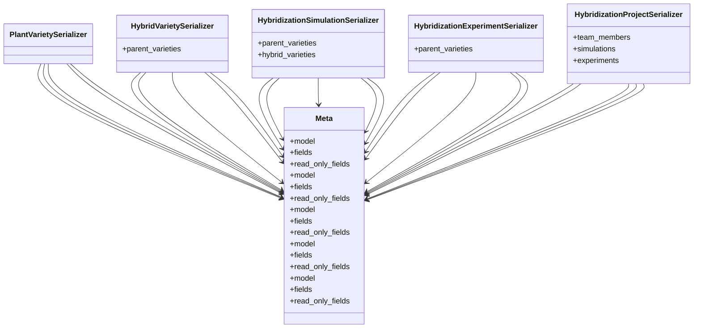

# agricultural_modules.seed_hybridization.merged.serializers

## Imports
- models
- rest_framework

## Classes
- PlantVarietySerializer
- HybridVarietySerializer
  - attr: `parent_varieties`
- HybridizationSimulationSerializer
  - attr: `parent_varieties`
  - attr: `hybrid_varieties`
- HybridizationExperimentSerializer
  - attr: `parent_varieties`
- HybridizationProjectSerializer
  - attr: `team_members`
  - attr: `simulations`
  - attr: `experiments`
- Meta
  - attr: `model`
  - attr: `fields`
  - attr: `read_only_fields`
- Meta
  - attr: `model`
  - attr: `fields`
  - attr: `read_only_fields`
- Meta
  - attr: `model`
  - attr: `fields`
  - attr: `read_only_fields`
- Meta
  - attr: `model`
  - attr: `fields`
  - attr: `read_only_fields`
- Meta
  - attr: `model`
  - attr: `fields`
  - attr: `read_only_fields`

## Class Diagram

