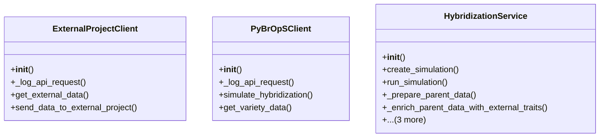

# agricultural_modules.seed_hybridization.merged.services

## Imports
- core_modules.api_keys.models
- django.conf
- django.db
- django.utils
- json
- logging
- models
- os
- requests
- time

## Classes
- ExternalProjectClient
  - method: `__init__`
  - method: `_log_api_request`
  - method: `get_external_data`
  - method: `send_data_to_external_project`
- PyBrOpSClient
  - method: `__init__`
  - method: `_log_api_request`
  - method: `simulate_hybridization`
  - method: `get_variety_data`
- HybridizationService
  - method: `__init__`
  - method: `create_simulation`
  - method: `run_simulation`
  - method: `_prepare_parent_data`
  - method: `_enrich_parent_data_with_external_traits`
  - method: `_post_results_to_external`
  - method: `_create_hybrid_varieties`
  - method: `get_simulation_results`

## Functions
- __init__
- _log_api_request
- get_external_data
- send_data_to_external_project
- __init__
- _log_api_request
- simulate_hybridization
- get_variety_data
- __init__
- create_simulation
- run_simulation
- _prepare_parent_data
- _enrich_parent_data_with_external_traits
- _post_results_to_external
- _create_hybrid_varieties
- get_simulation_results

## Module Variables
- `logger`

## Class Diagram

