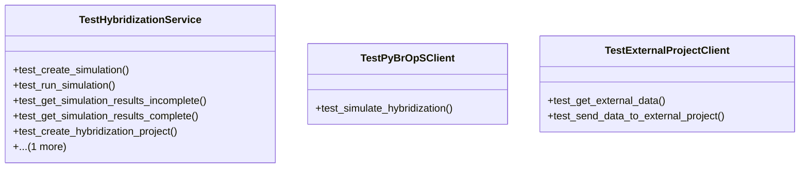

# agricultural_modules.seed_hybridization.merged.tests.test_services

## Imports
- django.contrib.auth
- django.utils
- json
- models
- pytest
- services
- unittest.mock

## Classes
- TestHybridizationService
  - method: `test_create_simulation`
  - method: `test_run_simulation`
  - method: `test_get_simulation_results_incomplete`
  - method: `test_get_simulation_results_complete`
  - method: `test_create_hybridization_project`
  - method: `test_create_hybridization_experiment`
- TestPyBrOpSClient
  - method: `test_simulate_hybridization`
- TestExternalProjectClient
  - method: `test_get_external_data`
  - method: `test_send_data_to_external_project`

## Functions
- user
- plant_varieties
- simulation
- test_create_simulation
- test_run_simulation
- test_get_simulation_results_incomplete
- test_get_simulation_results_complete
- test_create_hybridization_project
- test_create_hybridization_experiment
- test_simulate_hybridization
- test_get_external_data
- test_send_data_to_external_project

## Module Variables
- `User`

## Class Diagram

