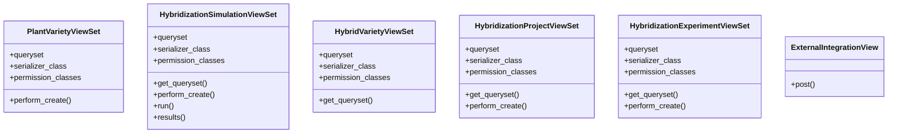

# agricultural_modules.seed_hybridization.merged.views

## Imports
- django.conf
- django.contrib
- django.contrib.auth.decorators
- django.http
- django.shortcuts
- django.urls
- django.utils.decorators
- django.views
- django.views.decorators.csrf
- json
- logging
- models
- rest_framework
- rest_framework.decorators
- rest_framework.response
- serializers
- services

## Classes
- PlantVarietyViewSet
  - attr: `queryset`
  - attr: `serializer_class`
  - attr: `permission_classes`
  - method: `perform_create`
- HybridizationSimulationViewSet
  - attr: `queryset`
  - attr: `serializer_class`
  - attr: `permission_classes`
  - method: `get_queryset`
  - method: `perform_create`
  - method: `run`
  - method: `results`
- HybridVarietyViewSet
  - attr: `queryset`
  - attr: `serializer_class`
  - attr: `permission_classes`
  - method: `get_queryset`
- HybridizationProjectViewSet
  - attr: `queryset`
  - attr: `serializer_class`
  - attr: `permission_classes`
  - method: `get_queryset`
  - method: `perform_create`
- HybridizationExperimentViewSet
  - attr: `queryset`
  - attr: `serializer_class`
  - attr: `permission_classes`
  - method: `get_queryset`
  - method: `perform_create`
- ExternalIntegrationView
  - method: `post`

## Functions
- dashboard
- variety_list
- variety_detail
- simulation_list
- simulation_detail
- create_simulation
- run_simulation
- project_list
- project_detail
- perform_create
- get_queryset
- perform_create
- run
- results
- get_queryset
- get_queryset
- perform_create
- get_queryset
- perform_create
- post

## Module Variables
- `logger`

## Class Diagram

