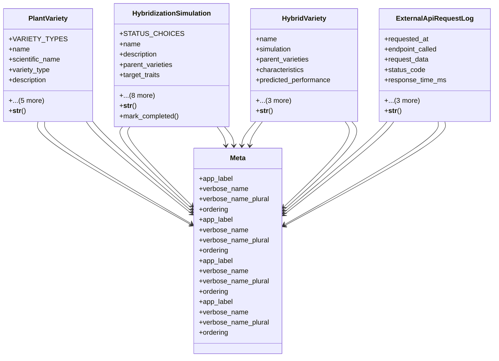

# agricultural_modules.seed_hybridization.models

## Imports
- django.conf
- django.db
- django.utils
- django.utils.translation

## Classes
- PlantVariety
  - attr: `VARIETY_TYPES`
  - attr: `name`
  - attr: `scientific_name`
  - attr: `variety_type`
  - attr: `description`
  - attr: `characteristics`
  - attr: `image`
  - attr: `created_by`
  - attr: `created_at`
  - attr: `updated_at`
  - method: `__str__`
- HybridizationSimulation
  - attr: `STATUS_CHOICES`
  - attr: `name`
  - attr: `description`
  - attr: `parent_varieties`
  - attr: `target_traits`
  - attr: `simulation_parameters`
  - attr: `status`
  - attr: `progress`
  - attr: `results`
  - attr: `created_by`
  - attr: `created_at`
  - attr: `updated_at`
  - attr: `completed_at`
  - method: `__str__`
  - method: `mark_completed`
- HybridVariety
  - attr: `name`
  - attr: `simulation`
  - attr: `parent_varieties`
  - attr: `characteristics`
  - attr: `predicted_performance`
  - attr: `recommendation_score`
  - attr: `notes`
  - attr: `created_at`
  - method: `__str__`
- ExternalApiRequestLog
  - attr: `requested_at`
  - attr: `endpoint_called`
  - attr: `request_data`
  - attr: `status_code`
  - attr: `response_time_ms`
  - attr: `response_data`
  - attr: `user`
  - attr: `error_message`
  - method: `__str__`
- Meta
  - attr: `app_label`
  - attr: `verbose_name`
  - attr: `verbose_name_plural`
  - attr: `ordering`
- Meta
  - attr: `app_label`
  - attr: `verbose_name`
  - attr: `verbose_name_plural`
  - attr: `ordering`
- Meta
  - attr: `app_label`
  - attr: `verbose_name`
  - attr: `verbose_name_plural`
  - attr: `ordering`
- Meta
  - attr: `app_label`
  - attr: `verbose_name`
  - attr: `verbose_name_plural`
  - attr: `ordering`

## Functions
- __str__
- __str__
- mark_completed
- __str__
- __str__

## Class Diagram

