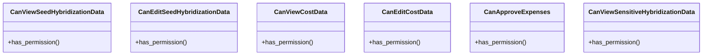

# agricultural_modules.seed_hybridization.permissions

## Imports
- rest_framework

## Classes
- CanViewSeedHybridizationData
  - method: `has_permission`
- CanEditSeedHybridizationData
  - method: `has_permission`
- CanViewCostData
  - method: `has_permission`
- CanEditCostData
  - method: `has_permission`
- CanApproveExpenses
  - method: `has_permission`
- CanViewSensitiveHybridizationData
  - method: `has_permission`

## Functions
- has_permission
- has_permission
- has_permission
- has_permission
- has_permission
- has_permission

## Class Diagram

