# agricultural_modules.seed_hybridization.serializers

## Imports
- rest_framework

## Classes
- ExperimentSummarySerializer
  - attr: `id`
  - attr: `name`
  - attr: `objective`
  - attr: `status`
  - attr: `start_date`
  - attr: `lead_researcher_name`
- ParentVarietySerializer
  - attr: `id`
  - attr: `name`
- ExperimentNoteSerializer
  - attr: `date`
  - attr: `author`
  - attr: `text`
- AssociatedDocumentSerializer
  - attr: `name`
  - attr: `link`
- ExperimentDetailSerializer
  - attr: `id`
  - attr: `name`
  - attr: `objective`
  - attr: `status`
  - attr: `start_date`
  - attr: `expected_end_date`
  - attr: `parent_varieties`
  - attr: `protocols_summary`
  - attr: `current_results_summary`
  - attr: `location`
  - attr: `lead_researcher_name`
  - attr: `team_members`
  - attr: `notes`
  - attr: `associated_documents`
- HybridVarietySummarySerializer
  - attr: `id`
  - attr: `name`
  - attr: `source_experiment_name`
  - attr: `status`
  - attr: `generation`
  - attr: `key_phenotypic_traits_summary`
- PhenotypicTraitsSerializer
  - attr: `plant_height_cm`
  - attr: `yield_potential_kg_ha`
  - attr: `protein_content_percentage`
  - attr: `disease_resistance_summary`
- EvaluationStageSerializer
  - attr: `stage_name`
  - attr: `status`
  - attr: `date`
  - attr: `summary`
- VarietyImageSerializer
  - attr: `description`
  - attr: `url`
- HybridVarietyDetailSerializer
  - attr: `id`
  - attr: `name`
  - attr: `source_experiment_id`
  - attr: `source_experiment_name`
  - attr: `status`
  - attr: `generation`
  - attr: `date_created`
  - attr: `genetic_markers`
  - attr: `phenotypic_traits`
  - attr: `evaluation_stages`
  - attr: `quantity_available_seeds_kg`
  - attr: `storage_location`
  - attr: `images`

## Class Diagram

```mermaid
classDiagram
    class ExperimentSummarySerializer {
        +id
        +name
        +objective
        +status
        +start_date
        +... (1 more)
    }
    class ParentVarietySerializer {
        +id
        +name
    }
    class ExperimentNoteSerializer {
        +date
        +author
        +text
    }
    class AssociatedDocumentSerializer {
        +name
        +link
    }
    class ExperimentDetailSerializer {
        +id
        +name
        +objective
        +status
        +start_date
        +... (9 more)
    }
    class HybridVarietySummarySerializer {
        +id
        +name
        +source_experiment_name
        +status
        +generation
        +... (1 more)
    }
    class PhenotypicTraitsSerializer {
        +plant_height_cm
        +yield_potential_kg_ha
        +protein_content_percentage
        +disease_resistance_summary
    }
    class EvaluationStageSerializer {
        +stage_name
        +status
        +date
        +summary
    }
    class VarietyImageSerializer {
        +description
        +url
    }
    class HybridVarietyDetailSerializer {
        +id
        +name
        +source_experiment_id
        +source_experiment_name
        +status
        +... (8 more)
    }
```

