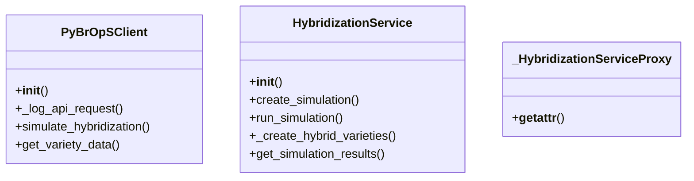

# agricultural_modules.seed_hybridization.services

## Imports
- django.conf
- django.db
- django.utils
- json
- logging
- models
- os
- requests
- time

## Classes
- PyBrOpSClient
  - method: `__init__`
  - method: `_log_api_request`
  - method: `simulate_hybridization`
  - method: `get_variety_data`
- HybridizationService
  - method: `__init__`
  - method: `create_simulation`
  - method: `run_simulation`
  - method: `_create_hybrid_varieties`
  - method: `get_simulation_results`
- _HybridizationServiceProxy
  - method: `__getattr__`

## Functions
- get_hybridization_service
- __init__
- _log_api_request
- simulate_hybridization
- get_variety_data
- __init__
- create_simulation
- run_simulation
- _create_hybrid_varieties
- get_simulation_results
- __getattr__

## Module Variables
- `logger`
- `_singleton_cache`
- `hybridization_service`

## Class Diagram

