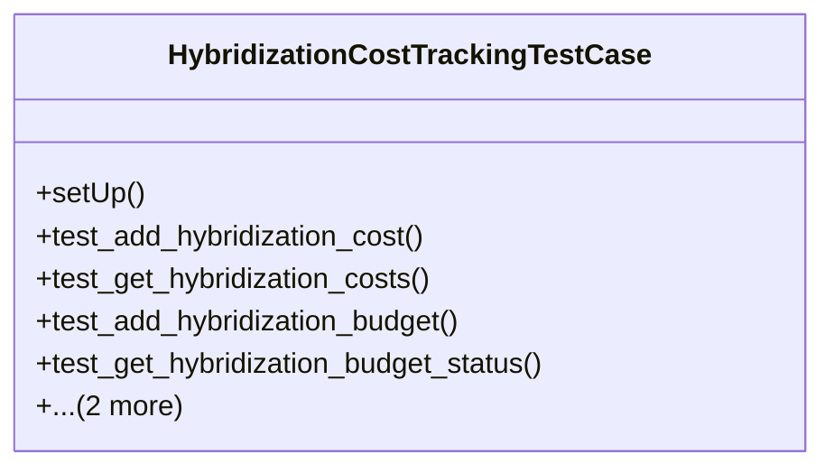

# agricultural_modules.seed_hybridization.tests.test_cost_tracking

## Imports
- cost_tracking
- datetime
- django.contrib.auth
- django.test
- django.utils
- json

## Classes
- HybridizationCostTrackingTestCase
  - method: `setUp`
  - method: `test_add_hybridization_cost`
  - method: `test_get_hybridization_costs`
  - method: `test_add_hybridization_budget`
  - method: `test_get_hybridization_budget_status`
  - method: `test_calculate_hybridization_cost_summary`
  - method: `test_remaining_budget_calculation`

## Functions
- setUp
- test_add_hybridization_cost
- test_get_hybridization_costs
- test_add_hybridization_budget
- test_get_hybridization_budget_status
- test_calculate_hybridization_cost_summary
- test_remaining_budget_calculation

## Module Variables
- `User`

## Class Diagram

