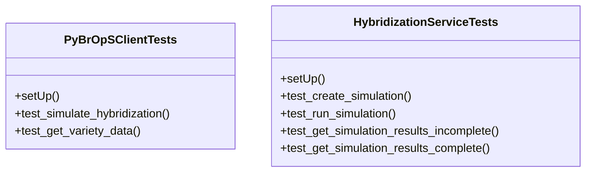

# agricultural_modules.seed_hybridization.tests.test_services

## Imports
- django.contrib.auth
- django.test
- django.utils
- json
- models
- services
- unittest
- unittest.mock

## Classes
- PyBrOpSClientTests
  - method: `setUp`
  - method: `test_simulate_hybridization`
  - method: `test_get_variety_data`
- HybridizationServiceTests
  - method: `setUp`
  - method: `test_create_simulation`
  - method: `test_run_simulation`
  - method: `test_get_simulation_results_incomplete`
  - method: `test_get_simulation_results_complete`

## Functions
- setUp
- test_simulate_hybridization
- test_get_variety_data
- setUp
- test_create_simulation
- test_run_simulation
- test_get_simulation_results_incomplete
- test_get_simulation_results_complete

## Module Variables
- `User`

## Class Diagram

