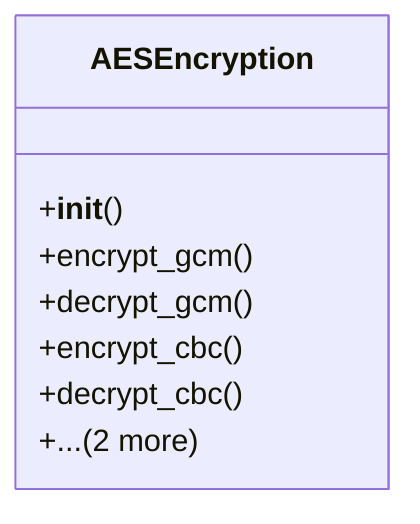

# agricultural_modules.seed_hybridization.utils.encryption

## Imports
- base64
- cryptography.hazmat.backends
- cryptography.hazmat.primitives
- cryptography.hazmat.primitives.ciphers
- cryptography.hazmat.primitives.ciphers.aead
- django.conf
- json
- os

## Classes
- AESEncryption
  - method: `__init__`
  - method: `encrypt_gcm`
  - method: `decrypt_gcm`
  - method: `encrypt_cbc`
  - method: `decrypt_cbc`
  - method: `encrypt`
  - method: `decrypt`

## Functions
- generate_encryption_key_base64
- __init__
- encrypt_gcm
- decrypt_gcm
- encrypt_cbc
- decrypt_cbc
- encrypt
- decrypt

## Class Diagram

