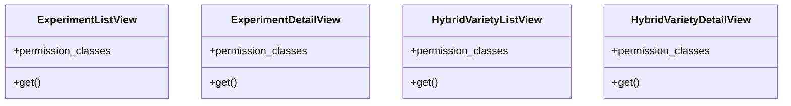

# agricultural_modules.seed_hybridization.views

## Imports
- django.conf
- permissions
- requests
- rest_framework
- rest_framework.permissions
- rest_framework.response
- rest_framework.views
- serializers

## Classes
- ExperimentListView
  - attr: `permission_classes`
  - method: `get`
- ExperimentDetailView
  - attr: `permission_classes`
  - method: `get`
- HybridVarietyListView
  - attr: `permission_classes`
  - method: `get`
- HybridVarietyDetailView
  - attr: `permission_classes`
  - method: `get`

## Functions
- make_external_api_request
- get
- get
- get
- get

## Module Variables
- `EXTERNAL_API_BASE_URL`
- `EXTERNAL_API_TIMEOUT`

## Class Diagram

