# agricultural_modules.seed_production.models

## Imports
- business_modules.inventory.models
- core_modules.core.models
- core_modules.organization.models
- django.conf
- django.db
- django.utils
- django.utils.translation

## Classes
- SeedProductionOrder
  - attr: `order_number`
  - attr: `product`
  - attr: `target_quantity_kg`
  - attr: `parent_male_code`
  - attr: `parent_male_quantity_kg`
  - attr: `parent_female_code`
  - attr: `parent_female_quantity_kg`
  - attr: `branch`
  - attr: `production_location_code`
  - attr: `planned_start_date`
  - attr: `planned_end_date`
  - attr: `status`
  - attr: `notes`
  - attr: `inventory_verified`
  - attr: `created_at`
  - attr: `updated_at`
  - attr: `created_by`
  - attr: `assigned_to`
  - method: `__str__`
- SeedProductionLot
  - attr: `lot_number`
  - attr: `production_order`
  - attr: `product`
  - attr: `branch`
  - attr: `status`
  - attr: `parent_male_code`
  - attr: `parent_female_code`
  - attr: `is_parent_info_restricted`
  - attr: `production_location_code`
  - attr: `planned_planting_date`
  - attr: `expected_production_date`
  - attr: `expected_seed_quantity_kg`
  - attr: `actual_planting_date`
  - attr: `actual_harvest_date`
  - attr: `harvested_quantity_kg`
  - attr: `seeds_per_gram`
  - attr: `treatment_material`
  - attr: `treatment_date`
  - attr: `germination_rate_percent`
  - attr: `hybrid_purity_percent`
  - attr: `passed_all_tests`
  - attr: `origin_country`
  - attr: `agricultural_certificate_number`
  - attr: `final_lot_number`
  - attr: `packaged_product_name`
  - attr: `packaging_date`
  - attr: `responsible_person`
  - attr: `created_at`
  - attr: `updated_at`
  - attr: `created_by`
  - method: `__str__`
- SeedLotTest
  - attr: `seed_lot`
  - attr: `test_type`
  - attr: `test_date`
  - attr: `result`
  - attr: `notes`
  - attr: `result_value`
  - attr: `tested_by`
  - method: `__str__`
- SeedProductionPlan
  - attr: `name`
  - attr: `code`
  - attr: `description`
  - attr: `start_date`
  - attr: `end_date`
  - attr: `is_active`
  - attr: `created_at`
  - attr: `updated_at`
  - attr: `created_by`
  - method: `__str__`
- SeedProductionActivity
  - attr: `seed_lot`
  - attr: `activity_type`
  - attr: `activity_date`
  - attr: `description`
  - attr: `performed_by`
  - attr: `materials_used`
  - attr: `quantity_used`
  - attr: `notes`
  - attr: `created_at`
  - method: `__str__`
- SeedInventoryMovement
  - attr: `seed_lot`
  - attr: `movement_type`
  - attr: `movement_date`
  - attr: `quantity_kg`
  - attr: `reference_lot`
  - attr: `notes`
  - attr: `performed_by`
  - attr: `created_at`
  - method: `__str__`
- OrderStatus
  - attr: `DRAFT`
  - attr: `APPROVED`
  - attr: `IN_PROGRESS`
  - attr: `COMPLETED`
  - attr: `CANCELLED`
- Meta
  - attr: `verbose_name`
  - attr: `verbose_name_plural`
  - attr: `ordering`
  - attr: `permissions`
- ProductionStatus
  - attr: `PLANNED`
  - attr: `PLANTED`
  - attr: `HARVESTING`
  - attr: `DRYING_TREATING`
  - attr: `TESTING`
  - attr: `PACKAGING`
  - attr: `COMPLETED`
  - attr: `DISCARDED`
- Meta
  - attr: `verbose_name`
  - attr: `verbose_name_plural`
  - attr: `ordering`
  - attr: `permissions`
- TestType
  - attr: `VIRAL`
  - attr: `BACTERIAL`
  - attr: `FUNGAL`
  - attr: `STONE_RESIDUE`
  - attr: `GERMINATION`
  - attr: `PURITY`
  - attr: `OTHER`
- TestResult
  - attr: `PENDING`
  - attr: `PASS`
  - attr: `FAIL`
- Meta
  - attr: `verbose_name`
  - attr: `verbose_name_plural`
  - attr: `ordering`
- Meta
  - attr: `verbose_name`
  - attr: `verbose_name_plural`
  - attr: `ordering`
- ActivityType
  - attr: `PLANTING`
  - attr: `IRRIGATION`
  - attr: `FERTILIZATION`
  - attr: `PEST_CONTROL`
  - attr: `POLLINATION`
  - attr: `ROGUING`
  - attr: `HARVESTING`
  - attr: `DRYING`
  - attr: `CLEANING`
  - attr: `TREATING`
  - attr: `TESTING`
  - attr: `PACKAGING`
  - attr: `INSPECTION`
  - attr: `OTHER`
- Meta
  - attr: `verbose_name`
  - attr: `verbose_name_plural`
  - attr: `ordering`
- MovementType
  - attr: `PARENT_SEED_OUT`
  - attr: `HARVEST_IN`
  - attr: `PROCESSING_LOSS`
  - attr: `SAMPLE_OUT`
  - attr: `FINAL_PRODUCT_IN`
  - attr: `DISCARD`
- Meta
  - attr: `verbose_name`
  - attr: `verbose_name_plural`
  - attr: `ordering`

## Functions
- __str__
- __str__
- __str__
- __str__
- __str__
- __str__

## Class Diagram

```mermaid
classDiagram
    class SeedProductionOrder {
        +order_number
        +product
        +target_quantity_kg
        +parent_male_code
        +parent_male_quantity_kg
        +... (13 more)
        +__str__()
    }
    class SeedProductionLot {
        +lot_number
        +production_order
        +product
        +branch
        +status
        +... (25 more)
        +__str__()
    }
    class SeedLotTest {
        +seed_lot
        +test_type
        +test_date
        +result
        +notes
        +... (2 more)
        +__str__()
    }
    class SeedProductionPlan {
        +name
        +code
        +description
        +start_date
        +end_date
        +... (4 more)
        +__str__()
    }
    class SeedProductionActivity {
        +seed_lot
        +activity_type
        +activity_date
        +description
        +performed_by
        +... (4 more)
        +__str__()
    }
    class SeedInventoryMovement {
        +seed_lot
        +movement_type
        +movement_date
        +quantity_kg
        +reference_lot
        +... (3 more)
        +__str__()
    }
    class OrderStatus {
        +DRAFT
        +APPROVED
        +IN_PROGRESS
        +COMPLETED
        +CANCELLED
    }
    class Meta {
        +verbose_name
        +verbose_name_plural
        +ordering
        +permissions
    }
    class ProductionStatus {
        +PLANNED
        +PLANTED
        +HARVESTING
        +DRYING_TREATING
        +TESTING
        +... (3 more)
    }
    class Meta {
        +verbose_name
        +verbose_name_plural
        +ordering
        +permissions
    }
    class TestType {
        +VIRAL
        +BACTERIAL
        +FUNGAL
        +STONE_RESIDUE
        +GERMINATION
        +... (2 more)
    }
    class TestResult {
        +PENDING
        +PASS
        +FAIL
    }
    class Meta {
        +verbose_name
        +verbose_name_plural
        +ordering
    }
    class Meta {
        +verbose_name
        +verbose_name_plural
        +ordering
    }
    class ActivityType {
        +PLANTING
        +IRRIGATION
        +FERTILIZATION
        +PEST_CONTROL
        +POLLINATION
        +... (9 more)
    }
    class Meta {
        +verbose_name
        +verbose_name_plural
        +ordering
    }
    class MovementType {
        +PARENT_SEED_OUT
        +HARVEST_IN
        +PROCESSING_LOSS
        +SAMPLE_OUT
        +FINAL_PRODUCT_IN
        +... (1 more)
    }
    class Meta {
        +verbose_name
        +verbose_name_plural
        +ordering
    }
    SeedProductionOrder --> Meta
    SeedProductionOrder --> Meta
    SeedProductionOrder --> Meta
    SeedProductionOrder --> Meta
    SeedProductionOrder --> Meta
    SeedProductionOrder --> Meta
    SeedProductionLot --> Meta
    SeedProductionLot --> Meta
    SeedProductionLot --> Meta
    SeedProductionLot --> Meta
    SeedProductionLot --> Meta
    SeedProductionLot --> Meta
    SeedLotTest --> Meta
    SeedLotTest --> Meta
    SeedLotTest --> Meta
    SeedLotTest --> Meta
    SeedLotTest --> Meta
    SeedLotTest --> Meta
    SeedProductionPlan --> Meta
    SeedProductionPlan --> Meta
    SeedProductionPlan --> Meta
    SeedProductionPlan --> Meta
    SeedProductionPlan --> Meta
    SeedProductionPlan --> Meta
    SeedProductionActivity --> Meta
    SeedProductionActivity --> Meta
    SeedProductionActivity --> Meta
    SeedProductionActivity --> Meta
    SeedProductionActivity --> Meta
    SeedProductionActivity --> Meta
    SeedInventoryMovement --> Meta
    SeedInventoryMovement --> Meta
    SeedInventoryMovement --> Meta
    SeedInventoryMovement --> Meta
    SeedInventoryMovement --> Meta
    SeedInventoryMovement --> Meta
    OrderStatus --> Meta
    OrderStatus --> Meta
    OrderStatus --> Meta
    OrderStatus --> Meta
    OrderStatus --> Meta
    OrderStatus --> Meta
    ProductionStatus --> Meta
    ProductionStatus --> Meta
    ProductionStatus --> Meta
    ProductionStatus --> Meta
    ProductionStatus --> Meta
    ProductionStatus --> Meta
    TestType --> Meta
    TestType --> Meta
    TestType --> Meta
    TestType --> Meta
    TestType --> Meta
    TestType --> Meta
    TestResult --> Meta
    TestResult --> Meta
    TestResult --> Meta
    TestResult --> Meta
    TestResult --> Meta
    TestResult --> Meta
    ActivityType --> Meta
    ActivityType --> Meta
    ActivityType --> Meta
    ActivityType --> Meta
    ActivityType --> Meta
    ActivityType --> Meta
    MovementType --> Meta
    MovementType --> Meta
    MovementType --> Meta
    MovementType --> Meta
    MovementType --> Meta
    MovementType --> Meta
```

