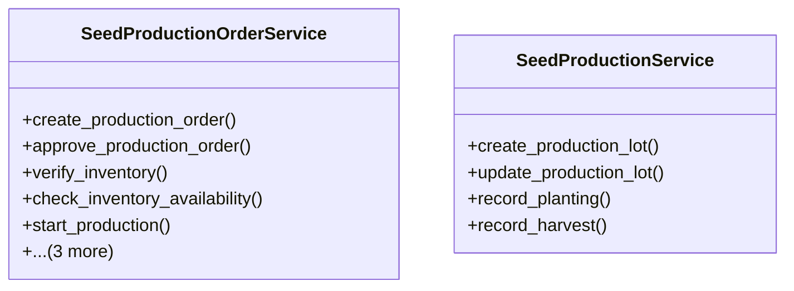

# agricultural_modules.seed_production.services

## Imports
- business_modules.inventory.services
- django.contrib.auth
- django.core.exceptions
- django.db
- django.utils
- models

## Classes
- SeedProductionOrderService
  - method: `create_production_order`
  - method: `approve_production_order`
  - method: `verify_inventory`
  - method: `check_inventory_availability`
  - method: `start_production`
  - method: `complete_production`
  - method: `cancel_production_order`
  - method: `create_lot_from_order`
- SeedProductionService
  - method: `create_production_lot`
  - method: `update_production_lot`
  - method: `record_planting`
  - method: `record_harvest`

## Functions
- create_production_order
- approve_production_order
- verify_inventory
- check_inventory_availability
- start_production
- complete_production
- cancel_production_order
- create_lot_from_order
- create_production_lot
- update_production_lot
- record_planting
- record_harvest

## Module Variables
- `User`

## Class Diagram

