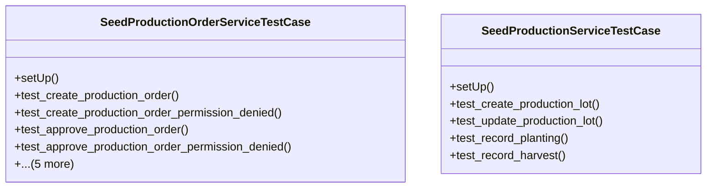

# agricultural_modules.seed_production.tests.test_services

## Imports
- datetime
- django.contrib.auth
- django.contrib.auth.models
- django.contrib.contenttypes.models
- django.core.exceptions
- django.test
- django.utils
- models
- services
- uuid

## Classes
- SeedProductionOrderServiceTestCase
  - method: `setUp`
  - method: `test_create_production_order`
  - method: `test_create_production_order_permission_denied`
  - method: `test_approve_production_order`
  - method: `test_approve_production_order_permission_denied`
  - method: `test_verify_inventory`
  - method: `test_start_production`
  - method: `test_complete_production`
  - method: `test_cancel_production_order`
  - method: `test_create_lot_from_order`
- SeedProductionServiceTestCase
  - method: `setUp`
  - method: `test_create_production_lot`
  - method: `test_update_production_lot`
  - method: `test_record_planting`
  - method: `test_record_harvest`

## Functions
- setUp
- test_create_production_order
- test_create_production_order_permission_denied
- test_approve_production_order
- test_approve_production_order_permission_denied
- test_verify_inventory
- test_start_production
- test_complete_production
- test_cancel_production_order
- test_create_lot_from_order
- setUp
- test_create_production_lot
- test_update_production_lot
- test_record_planting
- test_record_harvest

## Module Variables
- `User`

## Class Diagram

