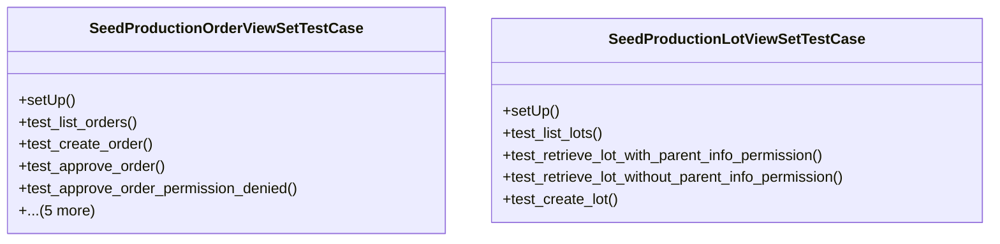

# agricultural_modules.seed_production.tests.test_views

## Imports
- datetime
- django.contrib.auth
- django.contrib.auth.models
- django.contrib.contenttypes.models
- django.test
- django.urls
- django.utils
- json
- models
- rest_framework
- rest_framework.test
- uuid

## Classes
- SeedProductionOrderViewSetTestCase
  - method: `setUp`
  - method: `test_list_orders`
  - method: `test_create_order`
  - method: `test_approve_order`
  - method: `test_approve_order_permission_denied`
  - method: `test_verify_inventory`
  - method: `test_start_production`
  - method: `test_complete_production`
  - method: `test_cancel_production`
  - method: `test_create_lot_from_order`
- SeedProductionLotViewSetTestCase
  - method: `setUp`
  - method: `test_list_lots`
  - method: `test_retrieve_lot_with_parent_info_permission`
  - method: `test_retrieve_lot_without_parent_info_permission`
  - method: `test_create_lot`

## Functions
- setUp
- test_list_orders
- test_create_order
- test_approve_order
- test_approve_order_permission_denied
- test_verify_inventory
- test_start_production
- test_complete_production
- test_cancel_production
- test_create_lot_from_order
- setUp
- test_list_lots
- test_retrieve_lot_with_parent_info_permission
- test_retrieve_lot_without_parent_info_permission
- test_create_lot

## Module Variables
- `User`

## Class Diagram

