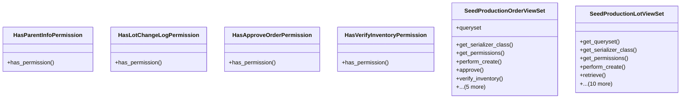

# agricultural_modules.seed_production.views

## Imports
- django.db
- django.shortcuts
- django.utils.translation
- models
- rest_framework
- rest_framework.decorators
- rest_framework.response
- serializers
- services

## Classes
- HasParentInfoPermission
  - method: `has_permission`
- HasLotChangeLogPermission
  - method: `has_permission`
- HasApproveOrderPermission
  - method: `has_permission`
- HasVerifyInventoryPermission
  - method: `has_permission`
- SeedProductionOrderViewSet
  - attr: `queryset`
  - method: `get_serializer_class`
  - method: `get_permissions`
  - method: `perform_create`
  - method: `approve`
  - method: `verify_inventory`
  - method: `check_inventory`
  - method: `start_production`
  - method: `complete_production`
  - method: `cancel_production`
  - method: `create_lot`
- SeedProductionLotViewSet
  - method: `get_queryset`
  - method: `get_serializer_class`
  - method: `get_permissions`
  - method: `perform_create`
  - method: `retrieve`
  - method: `update_status`
  - method: `record_planting`
  - method: `record_harvest`
  - method: `parent_info`
  - method: `tests`
  - method: `treatments`
  - method: `packaging`
  - method: `change_logs`
  - method: `record_germination_test`
  - method: `record_purity_test`

## Functions
- has_permission
- has_permission
- has_permission
- has_permission
- get_serializer_class
- get_permissions
- perform_create
- approve
- verify_inventory
- check_inventory
- start_production
- complete_production
- cancel_production
- create_lot
- get_queryset
- get_serializer_class
- get_permissions
- perform_create
- retrieve
- update_status
- record_planting
- record_harvest
- parent_info
- tests
- treatments
- packaging
- change_logs
- record_germination_test
- record_purity_test

## Class Diagram

