# agricultural_modules.variety_trials.admin

## Imports
- django.contrib
- models

## Classes
- TrialVarietyInline
  - attr: `model`
  - attr: `extra`
  - attr: `suit_classes`
- HarvestLogInLine
  - attr: `model`
  - attr: `extra`
  - attr: `suit_classes`
- HarvestQualityLogInLine
  - attr: `model`
  - attr: `extra`
- FruitSpecificationInline
  - attr: `model`
  - attr: `extra`
  - attr: `suit_classes`
- PlantSpecificationInline
  - attr: `model`
  - attr: `extra`
  - attr: `suit_classes`
- TrialCostInline
  - attr: `model`
  - attr: `extra`
  - attr: `suit_classes`
- TrialFertilizationProgramInline
  - attr: `model`
  - attr: `extra`
  - attr: `suit_classes`
- TrialPesticideProgramInline
  - attr: `model`
  - attr: `extra`
  - attr: `suit_classes`
- AIAnalysisInline
  - attr: `model`
  - attr: `extra`
  - attr: `readonly_fields`
  - attr: `can_delete`
  - attr: `max_num`
  - attr: `suit_classes`
- VarietyTrialAdmin
  - attr: `list_display`
  - attr: `list_filter`
  - attr: `search_fields`
  - attr: `readonly_fields`
  - attr: `fieldsets`
  - attr: `inlines`
  - attr: `suit_form_tabs`
- TrialVarietyAdmin
  - attr: `list_display`
  - attr: `list_filter`
  - attr: `search_fields`
  - attr: `raw_id_fields`
  - attr: `fieldsets`
  - attr: `inlines`
  - attr: `suit_form_tabs`
- HarvestLogAdmin
  - attr: `list_display`
  - attr: `list_filter`
  - attr: `search_fields`
  - attr: `autocomplete_fields`
  - attr: `readonly_fields`
  - attr: `inlines`
- HarvestQualityLogAdmin
  - attr: `list_display`
  - attr: `list_filter`
  - attr: `search_fields`
  - attr: `autocomplete_fields`
  - attr: `readonly_fields`
- FruitSpecificationAdmin
  - attr: `list_display`
  - attr: `list_filter`
  - attr: `search_fields`
  - attr: `autocomplete_fields`
  - attr: `readonly_fields`
- PlantSpecificationAdmin
  - attr: `list_display`
  - attr: `list_filter`
  - attr: `search_fields`
  - attr: `autocomplete_fields`
  - attr: `readonly_fields`
- TrialCostAdmin
  - attr: `list_display`
  - attr: `list_filter`
  - attr: `search_fields`
  - attr: `autocomplete_fields`
  - attr: `readonly_fields`
- TrialFertilizationProgramAdmin
  - attr: `list_display`
  - attr: `list_filter`
  - attr: `search_fields`
  - attr: `autocomplete_fields`
- TrialPesticideProgramAdmin
  - attr: `list_display`
  - attr: `list_filter`
  - attr: `search_fields`
  - attr: `autocomplete_fields`
- AIAnalysisAdmin
  - attr: `list_display`
  - attr: `list_filter`
  - attr: `search_fields`
  - attr: `readonly_fields`
  - attr: `raw_id_fields`
- TrialReportAdmin
  - attr: `list_display`
  - attr: `list_filter`
  - attr: `search_fields`
  - attr: `raw_id_fields`
- VarietyRecommendationAdmin
  - attr: `list_display`
  - attr: `list_filter`
  - attr: `search_fields`
  - attr: `raw_id_fields`

## Class Diagram

```mermaid
classDiagram
    class TrialVarietyInline {
        +model
        +extra
        +suit_classes
    }
    class HarvestLogInLine {
        +model
        +extra
        +suit_classes
    }
    class HarvestQualityLogInLine {
        +model
        +extra
    }
    class FruitSpecificationInline {
        +model
        +extra
        +suit_classes
    }
    class PlantSpecificationInline {
        +model
        +extra
        +suit_classes
    }
    class TrialCostInline {
        +model
        +extra
        +suit_classes
    }
    class TrialFertilizationProgramInline {
        +model
        +extra
        +suit_classes
    }
    class TrialPesticideProgramInline {
        +model
        +extra
        +suit_classes
    }
    class AIAnalysisInline {
        +model
        +extra
        +readonly_fields
        +can_delete
        +max_num
        +... (1 more)
    }
    class VarietyTrialAdmin {
        +list_display
        +list_filter
        +search_fields
        +readonly_fields
        +fieldsets
        +... (2 more)
    }
    class TrialVarietyAdmin {
        +list_display
        +list_filter
        +search_fields
        +raw_id_fields
        +fieldsets
        +... (2 more)
    }
    class HarvestLogAdmin {
        +list_display
        +list_filter
        +search_fields
        +autocomplete_fields
        +readonly_fields
        +... (1 more)
    }
    class HarvestQualityLogAdmin {
        +list_display
        +list_filter
        +search_fields
        +autocomplete_fields
        +readonly_fields
    }
    class FruitSpecificationAdmin {
        +list_display
        +list_filter
        +search_fields
        +autocomplete_fields
        +readonly_fields
    }
    class PlantSpecificationAdmin {
        +list_display
        +list_filter
        +search_fields
        +autocomplete_fields
        +readonly_fields
    }
    class TrialCostAdmin {
        +list_display
        +list_filter
        +search_fields
        +autocomplete_fields
        +readonly_fields
    }
    class TrialFertilizationProgramAdmin {
        +list_display
        +list_filter
        +search_fields
        +autocomplete_fields
    }
    class TrialPesticideProgramAdmin {
        +list_display
        +list_filter
        +search_fields
        +autocomplete_fields
    }
    class AIAnalysisAdmin {
        +list_display
        +list_filter
        +search_fields
        +readonly_fields
        +raw_id_fields
    }
    class TrialReportAdmin {
        +list_display
        +list_filter
        +search_fields
        +raw_id_fields
    }
    class VarietyRecommendationAdmin {
        +list_display
        +list_filter
        +search_fields
        +raw_id_fields
    }
```

