# agricultural_modules.variety_trials.models

## Imports
- django.conf
- django.db
- django.utils.translation

## Classes
- VarietyTrial
  - attr: `trial_name`
  - attr: `trial_code`
  - attr: `SEASON_CHOICES`
  - attr: `season`
  - attr: `planting_date`
  - attr: `location_description`
  - attr: `farm_plot`
  - attr: `total_area_sqm`
  - attr: `number_of_replicates`
  - attr: `STATUS_CHOICES`
  - attr: `status`
  - attr: `created_by`
  - attr: `created_at`
  - attr: `updated_at`
  - method: `__str__`
- TrialVariety
  - attr: `trial`
  - attr: `plant_species_or_variety_name`
  - attr: `variety_code`
  - attr: `lot_number`
  - attr: `number_of_plants`
  - attr: `area_planted_sqm`
  - attr: `seed_source`
  - attr: `is_control_variety`
  - attr: `competitor_price`
  - attr: `seed_inventory_item`
  - attr: `notes`
  - method: `__str__`
- HarvestLog
  - attr: `trial_variety`
  - attr: `harvest_date`
  - attr: `harvest_number`
  - attr: `total_fruit_count`
  - attr: `total_fruit_weight_kg`
  - attr: `average_fruit_weight_g`
  - attr: `notes`
  - attr: `created_at`
  - method: `__str__`
- HarvestQualityLog
  - attr: `harvest_log`
  - attr: `QUALITY_GRADE_CHOICES`
  - attr: `quality_grade`
  - attr: `fruit_count`
  - attr: `fruit_weight_kg`
  - attr: `created_at`
  - method: `__str__`
- FruitSpecification
  - attr: `trial_variety`
  - attr: `evaluation_date`
  - attr: `length_cm`
  - attr: `shape_uniformity_rating`
  - attr: `deformation_percentage`
  - attr: `firmness_rating`
  - attr: `color_description`
  - attr: `color_rating`
  - attr: `storage_transport_tolerance_rating`
  - attr: `brix_value`
  - attr: `notes`
  - attr: `created_at`
  - method: `__str__`
- PlantSpecification
  - attr: `trial_variety`
  - attr: `evaluation_date`
  - attr: `earliness_rating`
  - attr: `plant_vigor_rating`
  - attr: `leaf_shape_description`
  - attr: `fruit_coverage_rating`
  - attr: `fungal_resistance_rating`
  - attr: `bacterial_resistance_rating`
  - attr: `insect_resistance_rating`
  - attr: `viral_resistance_rating`
  - attr: `cold_tolerance_rating`
  - attr: `heat_tolerance_rating`
  - attr: `soil_salinity_tolerance_rating`
  - attr: `water_salinity_tolerance_rating`
  - attr: `drought_tolerance_rating`
  - attr: `notes`
  - attr: `created_at`
  - method: `__str__`
- TrialCost
  - attr: `trial`
  - attr: `COST_TYPE_CHOICES`
  - attr: `cost_type`
  - attr: `description`
  - attr: `amount`
  - attr: `date_incurred`
  - attr: `notes`
  - attr: `created_by`
  - attr: `created_at`
  - method: `__str__`
- TrialFertilizationProgram
  - attr: `trial`
  - attr: `fertilizer_name`
  - attr: `application_date`
  - attr: `days_after_planting`
  - attr: `rate_per_hectare`
  - attr: `UNIT_CHOICES`
  - attr: `unit`
  - attr: `APPLICATION_METHOD_CHOICES`
  - attr: `application_method`
  - attr: `notes`
  - attr: `created_at`
  - method: `__str__`
- TrialPesticideProgram
  - attr: `trial`
  - attr: `pesticide_name`
  - attr: `PESTICIDE_TYPE_CHOICES`
  - attr: `pesticide_type`
  - attr: `target_pest`
  - attr: `application_date`
  - attr: `days_after_planting`
  - attr: `rate_per_hectare`
  - attr: `UNIT_CHOICES`
  - attr: `unit`
  - attr: `APPLICATION_METHOD_CHOICES`
  - attr: `application_method`
  - attr: `effectiveness_rating`
  - attr: `notes`
  - attr: `created_at`
  - method: `__str__`
- TrialReport
  - attr: `trial`
  - attr: `report_date`
  - attr: `title`
  - attr: `summary`
  - attr: `methodology`
  - attr: `results`
  - attr: `conclusions`
  - attr: `recommendations`
  - attr: `REPORT_STATUS_CHOICES`
  - attr: `status`
  - attr: `created_by`
  - attr: `created_at`
  - attr: `updated_at`
  - method: `__str__`
- VarietyRecommendation
  - attr: `trial_variety`
  - attr: `evaluation_date`
  - attr: `overall_rating`
  - attr: `strengths`
  - attr: `weaknesses`
  - attr: `market_potential`
  - attr: `recommended_price`
  - attr: `recommended_regions`
  - attr: `RECOMMENDATION_CHOICES`
  - attr: `recommendation`
  - attr: `notes`
  - attr: `created_by`
  - attr: `created_at`
  - attr: `updated_at`
  - method: `__str__`
- AIAnalysis
  - attr: `trial`
  - attr: `analysis_date`
  - attr: `ANALYSIS_TYPE_CHOICES`
  - attr: `analysis_type`
  - attr: `model_version`
  - attr: `input_parameters`
  - attr: `results`
  - attr: `summary`
  - attr: `confidence_score`
  - attr: `recommendations`
  - attr: `created_by`
  - method: `__str__`
- Meta
  - attr: `verbose_name`
  - attr: `verbose_name_plural`
  - attr: `ordering`
- Meta
  - attr: `verbose_name`
  - attr: `verbose_name_plural`
  - attr: `unique_together`
  - attr: `ordering`
- Meta
  - attr: `verbose_name`
  - attr: `verbose_name_plural`
  - attr: `ordering`
- Meta
  - attr: `verbose_name`
  - attr: `verbose_name_plural`
  - attr: `ordering`
- Meta
  - attr: `verbose_name`
  - attr: `verbose_name_plural`
  - attr: `ordering`
- Meta
  - attr: `verbose_name`
  - attr: `verbose_name_plural`
  - attr: `ordering`
- Meta
  - attr: `verbose_name`
  - attr: `verbose_name_plural`
  - attr: `ordering`
- Meta
  - attr: `verbose_name`
  - attr: `verbose_name_plural`
  - attr: `ordering`
- Meta
  - attr: `verbose_name`
  - attr: `verbose_name_plural`
  - attr: `ordering`
- Meta
  - attr: `verbose_name`
  - attr: `verbose_name_plural`
  - attr: `ordering`
- Meta
  - attr: `verbose_name`
  - attr: `verbose_name_plural`
  - attr: `ordering`
- Meta
  - attr: `verbose_name`
  - attr: `verbose_name_plural`
  - attr: `ordering`

## Functions
- __str__
- __str__
- __str__
- __str__
- __str__
- __str__
- __str__
- __str__
- __str__
- __str__
- __str__
- __str__

## Module Variables
- `RATING_CHOICES`

## Class Diagram

```mermaid
classDiagram
    class VarietyTrial {
        +trial_name
        +trial_code
        +SEASON_CHOICES
        +season
        +planting_date
        +... (9 more)
        +__str__()
    }
    class TrialVariety {
        +trial
        +plant_species_or_variety_name
        +variety_code
        +lot_number
        +number_of_plants
        +... (6 more)
        +__str__()
    }
    class HarvestLog {
        +trial_variety
        +harvest_date
        +harvest_number
        +total_fruit_count
        +total_fruit_weight_kg
        +... (3 more)
        +__str__()
    }
    class HarvestQualityLog {
        +harvest_log
        +QUALITY_GRADE_CHOICES
        +quality_grade
        +fruit_count
        +fruit_weight_kg
        +... (1 more)
        +__str__()
    }
    class FruitSpecification {
        +trial_variety
        +evaluation_date
        +length_cm
        +shape_uniformity_rating
        +deformation_percentage
        +... (7 more)
        +__str__()
    }
    class PlantSpecification {
        +trial_variety
        +evaluation_date
        +earliness_rating
        +plant_vigor_rating
        +leaf_shape_description
        +... (12 more)
        +__str__()
    }
    class TrialCost {
        +trial
        +COST_TYPE_CHOICES
        +cost_type
        +description
        +amount
        +... (4 more)
        +__str__()
    }
    class TrialFertilizationProgram {
        +trial
        +fertilizer_name
        +application_date
        +days_after_planting
        +rate_per_hectare
        +... (6 more)
        +__str__()
    }
    class TrialPesticideProgram {
        +trial
        +pesticide_name
        +PESTICIDE_TYPE_CHOICES
        +pesticide_type
        +target_pest
        +... (10 more)
        +__str__()
    }
    class TrialReport {
        +trial
        +report_date
        +title
        +summary
        +methodology
        +... (8 more)
        +__str__()
    }
    class VarietyRecommendation {
        +trial_variety
        +evaluation_date
        +overall_rating
        +strengths
        +weaknesses
        +... (9 more)
        +__str__()
    }
    class AIAnalysis {
        +trial
        +analysis_date
        +ANALYSIS_TYPE_CHOICES
        +analysis_type
        +model_version
        +... (6 more)
        +__str__()
    }
    class Meta {
        +verbose_name
        +verbose_name_plural
        +ordering
    }
    class Meta {
        +verbose_name
        +verbose_name_plural
        +unique_together
        +ordering
    }
    class Meta {
        +verbose_name
        +verbose_name_plural
        +ordering
    }
    class Meta {
        +verbose_name
        +verbose_name_plural
        +ordering
    }
    class Meta {
        +verbose_name
        +verbose_name_plural
        +ordering
    }
    class Meta {
        +verbose_name
        +verbose_name_plural
        +ordering
    }
    class Meta {
        +verbose_name
        +verbose_name_plural
        +ordering
    }
    class Meta {
        +verbose_name
        +verbose_name_plural
        +ordering
    }
    class Meta {
        +verbose_name
        +verbose_name_plural
        +ordering
    }
    class Meta {
        +verbose_name
        +verbose_name_plural
        +ordering
    }
    class Meta {
        +verbose_name
        +verbose_name_plural
        +ordering
    }
    class Meta {
        +verbose_name
        +verbose_name_plural
        +ordering
    }
    VarietyTrial --> Meta
    VarietyTrial --> Meta
    VarietyTrial --> Meta
    VarietyTrial --> Meta
    VarietyTrial --> Meta
    VarietyTrial --> Meta
    VarietyTrial --> Meta
    VarietyTrial --> Meta
    VarietyTrial --> Meta
    VarietyTrial --> Meta
    VarietyTrial --> Meta
    VarietyTrial --> Meta
    TrialVariety --> Meta
    TrialVariety --> Meta
    TrialVariety --> Meta
    TrialVariety --> Meta
    TrialVariety --> Meta
    TrialVariety --> Meta
    TrialVariety --> Meta
    TrialVariety --> Meta
    TrialVariety --> Meta
    TrialVariety --> Meta
    TrialVariety --> Meta
    TrialVariety --> Meta
    HarvestLog --> Meta
    HarvestLog --> Meta
    HarvestLog --> Meta
    HarvestLog --> Meta
    HarvestLog --> Meta
    HarvestLog --> Meta
    HarvestLog --> Meta
    HarvestLog --> Meta
    HarvestLog --> Meta
    HarvestLog --> Meta
    HarvestLog --> Meta
    HarvestLog --> Meta
    HarvestQualityLog --> Meta
    HarvestQualityLog --> Meta
    HarvestQualityLog --> Meta
    HarvestQualityLog --> Meta
    HarvestQualityLog --> Meta
    HarvestQualityLog --> Meta
    HarvestQualityLog --> Meta
    HarvestQualityLog --> Meta
    HarvestQualityLog --> Meta
    HarvestQualityLog --> Meta
    HarvestQualityLog --> Meta
    HarvestQualityLog --> Meta
    FruitSpecification --> Meta
    FruitSpecification --> Meta
    FruitSpecification --> Meta
    FruitSpecification --> Meta
    FruitSpecification --> Meta
    FruitSpecification --> Meta
    FruitSpecification --> Meta
    FruitSpecification --> Meta
    FruitSpecification --> Meta
    FruitSpecification --> Meta
    FruitSpecification --> Meta
    FruitSpecification --> Meta
    PlantSpecification --> Meta
    PlantSpecification --> Meta
    PlantSpecification --> Meta
    PlantSpecification --> Meta
    PlantSpecification --> Meta
    PlantSpecification --> Meta
    PlantSpecification --> Meta
    PlantSpecification --> Meta
    PlantSpecification --> Meta
    PlantSpecification --> Meta
    PlantSpecification --> Meta
    PlantSpecification --> Meta
    TrialCost --> Meta
    TrialCost --> Meta
    TrialCost --> Meta
    TrialCost --> Meta
    TrialCost --> Meta
    TrialCost --> Meta
    TrialCost --> Meta
    TrialCost --> Meta
    TrialCost --> Meta
    TrialCost --> Meta
    TrialCost --> Meta
    TrialCost --> Meta
    TrialFertilizationProgram --> Meta
    TrialFertilizationProgram --> Meta
    TrialFertilizationProgram --> Meta
    TrialFertilizationProgram --> Meta
    TrialFertilizationProgram --> Meta
    TrialFertilizationProgram --> Meta
    TrialFertilizationProgram --> Meta
    TrialFertilizationProgram --> Meta
    TrialFertilizationProgram --> Meta
    TrialFertilizationProgram --> Meta
    TrialFertilizationProgram --> Meta
    TrialFertilizationProgram --> Meta
    TrialPesticideProgram --> Meta
    TrialPesticideProgram --> Meta
    TrialPesticideProgram --> Meta
    TrialPesticideProgram --> Meta
    TrialPesticideProgram --> Meta
    TrialPesticideProgram --> Meta
    TrialPesticideProgram --> Meta
    TrialPesticideProgram --> Meta
    TrialPesticideProgram --> Meta
    TrialPesticideProgram --> Meta
    TrialPesticideProgram --> Meta
    TrialPesticideProgram --> Meta
    TrialReport --> Meta
    TrialReport --> Meta
    TrialReport --> Meta
    TrialReport --> Meta
    TrialReport --> Meta
    TrialReport --> Meta
    TrialReport --> Meta
    TrialReport --> Meta
    TrialReport --> Meta
    TrialReport --> Meta
    TrialReport --> Meta
    TrialReport --> Meta
    VarietyRecommendation --> Meta
    VarietyRecommendation --> Meta
    VarietyRecommendation --> Meta
    VarietyRecommendation --> Meta
    VarietyRecommendation --> Meta
    VarietyRecommendation --> Meta
    VarietyRecommendation --> Meta
    VarietyRecommendation --> Meta
    VarietyRecommendation --> Meta
    VarietyRecommendation --> Meta
    VarietyRecommendation --> Meta
    VarietyRecommendation --> Meta
    AIAnalysis --> Meta
    AIAnalysis --> Meta
    AIAnalysis --> Meta
    AIAnalysis --> Meta
    AIAnalysis --> Meta
    AIAnalysis --> Meta
    AIAnalysis --> Meta
    AIAnalysis --> Meta
    AIAnalysis --> Meta
    AIAnalysis --> Meta
    AIAnalysis --> Meta
    AIAnalysis --> Meta
```

