# agricultural_modules.variety_trials.serializers

## Imports
- models
- rest_framework

## Classes
- TrialLocationSerializer
- TrialSeasonSerializer
- CompetitorVarietySerializer
- TrialVarietySerializer
- TrialReplicateSerializer
- HarvestDataSerializer
- FruitCharacteristicSerializer
- PlantCharacteristicSerializer
- TrialFertilizationProgramSerializer
- TrialPesticideProgramSerializer
- TrialCostSerializer
- TrialReportSerializer
- VarietyTrialListSerializer
  - attr: `location_name`
  - attr: `season_name`
  - attr: `variety_count`
  - method: `get_variety_count`
- VarietyTrialDetailSerializer
  - attr: `location`
  - attr: `season`
  - attr: `varieties`
  - attr: `fertilization_programs`
  - attr: `pesticide_programs`
  - attr: `costs`
  - attr: `reports`
- Meta
  - attr: `model`
  - attr: `fields`
- Meta
  - attr: `model`
  - attr: `fields`
- Meta
  - attr: `model`
  - attr: `fields`
- Meta
  - attr: `model`
  - attr: `fields`
  - attr: `depth`
- Meta
  - attr: `model`
  - attr: `fields`
- Meta
  - attr: `model`
  - attr: `fields`
- Meta
  - attr: `model`
  - attr: `fields`
- Meta
  - attr: `model`
  - attr: `fields`
- Meta
  - attr: `model`
  - attr: `fields`
- Meta
  - attr: `model`
  - attr: `fields`
- Meta
  - attr: `model`
  - attr: `fields`
- Meta
  - attr: `model`
  - attr: `fields`
- Meta
  - attr: `model`
  - attr: `fields`
- Meta
  - attr: `model`
  - attr: `fields`

## Functions
- get_variety_count

## Class Diagram

```mermaid
classDiagram
    class TrialLocationSerializer {
    }
    class TrialSeasonSerializer {
    }
    class CompetitorVarietySerializer {
    }
    class TrialVarietySerializer {
    }
    class TrialReplicateSerializer {
    }
    class HarvestDataSerializer {
    }
    class FruitCharacteristicSerializer {
    }
    class PlantCharacteristicSerializer {
    }
    class TrialFertilizationProgramSerializer {
    }
    class TrialPesticideProgramSerializer {
    }
    class TrialCostSerializer {
    }
    class TrialReportSerializer {
    }
    class VarietyTrialListSerializer {
        +location_name
        +season_name
        +variety_count
        +get_variety_count()
    }
    class VarietyTrialDetailSerializer {
        +location
        +season
        +varieties
        +fertilization_programs
        +pesticide_programs
        +... (2 more)
    }
    class Meta {
        +model
        +fields
    }
    class Meta {
        +model
        +fields
    }
    class Meta {
        +model
        +fields
    }
    class Meta {
        +model
        +fields
        +depth
    }
    class Meta {
        +model
        +fields
    }
    class Meta {
        +model
        +fields
    }
    class Meta {
        +model
        +fields
    }
    class Meta {
        +model
        +fields
    }
    class Meta {
        +model
        +fields
    }
    class Meta {
        +model
        +fields
    }
    class Meta {
        +model
        +fields
    }
    class Meta {
        +model
        +fields
    }
    class Meta {
        +model
        +fields
    }
    class Meta {
        +model
        +fields
    }
    TrialLocationSerializer --> Meta
    TrialLocationSerializer --> Meta
    TrialLocationSerializer --> Meta
    TrialLocationSerializer --> Meta
    TrialLocationSerializer --> Meta
    TrialLocationSerializer --> Meta
    TrialLocationSerializer --> Meta
    TrialLocationSerializer --> Meta
    TrialLocationSerializer --> Meta
    TrialLocationSerializer --> Meta
    TrialLocationSerializer --> Meta
    TrialLocationSerializer --> Meta
    TrialLocationSerializer --> Meta
    TrialLocationSerializer --> Meta
    TrialSeasonSerializer --> Meta
    TrialSeasonSerializer --> Meta
    TrialSeasonSerializer --> Meta
    TrialSeasonSerializer --> Meta
    TrialSeasonSerializer --> Meta
    TrialSeasonSerializer --> Meta
    TrialSeasonSerializer --> Meta
    TrialSeasonSerializer --> Meta
    TrialSeasonSerializer --> Meta
    TrialSeasonSerializer --> Meta
    TrialSeasonSerializer --> Meta
    TrialSeasonSerializer --> Meta
    TrialSeasonSerializer --> Meta
    TrialSeasonSerializer --> Meta
    CompetitorVarietySerializer --> Meta
    CompetitorVarietySerializer --> Meta
    CompetitorVarietySerializer --> Meta
    CompetitorVarietySerializer --> Meta
    CompetitorVarietySerializer --> Meta
    CompetitorVarietySerializer --> Meta
    CompetitorVarietySerializer --> Meta
    CompetitorVarietySerializer --> Meta
    CompetitorVarietySerializer --> Meta
    CompetitorVarietySerializer --> Meta
    CompetitorVarietySerializer --> Meta
    CompetitorVarietySerializer --> Meta
    CompetitorVarietySerializer --> Meta
    CompetitorVarietySerializer --> Meta
    TrialVarietySerializer --> Meta
    TrialVarietySerializer --> Meta
    TrialVarietySerializer --> Meta
    TrialVarietySerializer --> Meta
    TrialVarietySerializer --> Meta
    TrialVarietySerializer --> Meta
    TrialVarietySerializer --> Meta
    TrialVarietySerializer --> Meta
    TrialVarietySerializer --> Meta
    TrialVarietySerializer --> Meta
    TrialVarietySerializer --> Meta
    TrialVarietySerializer --> Meta
    TrialVarietySerializer --> Meta
    TrialVarietySerializer --> Meta
    TrialReplicateSerializer --> Meta
    TrialReplicateSerializer --> Meta
    TrialReplicateSerializer --> Meta
    TrialReplicateSerializer --> Meta
    TrialReplicateSerializer --> Meta
    TrialReplicateSerializer --> Meta
    TrialReplicateSerializer --> Meta
    TrialReplicateSerializer --> Meta
    TrialReplicateSerializer --> Meta
    TrialReplicateSerializer --> Meta
    TrialReplicateSerializer --> Meta
    TrialReplicateSerializer --> Meta
    TrialReplicateSerializer --> Meta
    TrialReplicateSerializer --> Meta
    HarvestDataSerializer --> Meta
    HarvestDataSerializer --> Meta
    HarvestDataSerializer --> Meta
    HarvestDataSerializer --> Meta
    HarvestDataSerializer --> Meta
    HarvestDataSerializer --> Meta
    HarvestDataSerializer --> Meta
    HarvestDataSerializer --> Meta
    HarvestDataSerializer --> Meta
    HarvestDataSerializer --> Meta
    HarvestDataSerializer --> Meta
    HarvestDataSerializer --> Meta
    HarvestDataSerializer --> Meta
    HarvestDataSerializer --> Meta
    FruitCharacteristicSerializer --> Meta
    FruitCharacteristicSerializer --> Meta
    FruitCharacteristicSerializer --> Meta
    FruitCharacteristicSerializer --> Meta
    FruitCharacteristicSerializer --> Meta
    FruitCharacteristicSerializer --> Meta
    FruitCharacteristicSerializer --> Meta
    FruitCharacteristicSerializer --> Meta
    FruitCharacteristicSerializer --> Meta
    FruitCharacteristicSerializer --> Meta
    FruitCharacteristicSerializer --> Meta
    FruitCharacteristicSerializer --> Meta
    FruitCharacteristicSerializer --> Meta
    FruitCharacteristicSerializer --> Meta
    PlantCharacteristicSerializer --> Meta
    PlantCharacteristicSerializer --> Meta
    PlantCharacteristicSerializer --> Meta
    PlantCharacteristicSerializer --> Meta
    PlantCharacteristicSerializer --> Meta
    PlantCharacteristicSerializer --> Meta
    PlantCharacteristicSerializer --> Meta
    PlantCharacteristicSerializer --> Meta
    PlantCharacteristicSerializer --> Meta
    PlantCharacteristicSerializer --> Meta
    PlantCharacteristicSerializer --> Meta
    PlantCharacteristicSerializer --> Meta
    PlantCharacteristicSerializer --> Meta
    PlantCharacteristicSerializer --> Meta
    TrialFertilizationProgramSerializer --> Meta
    TrialFertilizationProgramSerializer --> Meta
    TrialFertilizationProgramSerializer --> Meta
    TrialFertilizationProgramSerializer --> Meta
    TrialFertilizationProgramSerializer --> Meta
    TrialFertilizationProgramSerializer --> Meta
    TrialFertilizationProgramSerializer --> Meta
    TrialFertilizationProgramSerializer --> Meta
    TrialFertilizationProgramSerializer --> Meta
    TrialFertilizationProgramSerializer --> Meta
    TrialFertilizationProgramSerializer --> Meta
    TrialFertilizationProgramSerializer --> Meta
    TrialFertilizationProgramSerializer --> Meta
    TrialFertilizationProgramSerializer --> Meta
    TrialPesticideProgramSerializer --> Meta
    TrialPesticideProgramSerializer --> Meta
    TrialPesticideProgramSerializer --> Meta
    TrialPesticideProgramSerializer --> Meta
    TrialPesticideProgramSerializer --> Meta
    TrialPesticideProgramSerializer --> Meta
    TrialPesticideProgramSerializer --> Meta
    TrialPesticideProgramSerializer --> Meta
    TrialPesticideProgramSerializer --> Meta
    TrialPesticideProgramSerializer --> Meta
    TrialPesticideProgramSerializer --> Meta
    TrialPesticideProgramSerializer --> Meta
    TrialPesticideProgramSerializer --> Meta
    TrialPesticideProgramSerializer --> Meta
    TrialCostSerializer --> Meta
    TrialCostSerializer --> Meta
    TrialCostSerializer --> Meta
    TrialCostSerializer --> Meta
    TrialCostSerializer --> Meta
    TrialCostSerializer --> Meta
    TrialCostSerializer --> Meta
    TrialCostSerializer --> Meta
    TrialCostSerializer --> Meta
    TrialCostSerializer --> Meta
    TrialCostSerializer --> Meta
    TrialCostSerializer --> Meta
    TrialCostSerializer --> Meta
    TrialCostSerializer --> Meta
    TrialReportSerializer --> Meta
    TrialReportSerializer --> Meta
    TrialReportSerializer --> Meta
    TrialReportSerializer --> Meta
    TrialReportSerializer --> Meta
    TrialReportSerializer --> Meta
    TrialReportSerializer --> Meta
    TrialReportSerializer --> Meta
    TrialReportSerializer --> Meta
    TrialReportSerializer --> Meta
    TrialReportSerializer --> Meta
    TrialReportSerializer --> Meta
    TrialReportSerializer --> Meta
    TrialReportSerializer --> Meta
    VarietyTrialListSerializer --> Meta
    VarietyTrialListSerializer --> Meta
    VarietyTrialListSerializer --> Meta
    VarietyTrialListSerializer --> Meta
    VarietyTrialListSerializer --> Meta
    VarietyTrialListSerializer --> Meta
    VarietyTrialListSerializer --> Meta
    VarietyTrialListSerializer --> Meta
    VarietyTrialListSerializer --> Meta
    VarietyTrialListSerializer --> Meta
    VarietyTrialListSerializer --> Meta
    VarietyTrialListSerializer --> Meta
    VarietyTrialListSerializer --> Meta
    VarietyTrialListSerializer --> Meta
    VarietyTrialDetailSerializer --> Meta
    VarietyTrialDetailSerializer --> Meta
    VarietyTrialDetailSerializer --> Meta
    VarietyTrialDetailSerializer --> Meta
    VarietyTrialDetailSerializer --> Meta
    VarietyTrialDetailSerializer --> Meta
    VarietyTrialDetailSerializer --> Meta
    VarietyTrialDetailSerializer --> Meta
    VarietyTrialDetailSerializer --> Meta
    VarietyTrialDetailSerializer --> Meta
    VarietyTrialDetailSerializer --> Meta
    VarietyTrialDetailSerializer --> Meta
    VarietyTrialDetailSerializer --> Meta
    VarietyTrialDetailSerializer --> Meta
```

