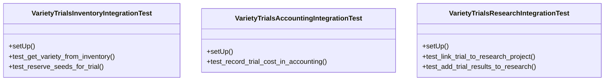

# agricultural_modules.variety_trials.tests.test_integration

## Imports
- agricultural_modules.research.models
- agricultural_modules.research.services
- agricultural_modules.variety_trials.models
- agricultural_modules.variety_trials.services
- business_modules.accounting.models
- business_modules.accounting.services
- business_modules.inventory.models
- business_modules.inventory.services
- datetime
- django.contrib.auth.models
- django.test
- unittest

## Classes
- VarietyTrialsInventoryIntegrationTest
  - method: `setUp`
  - method: `test_get_variety_from_inventory`
  - method: `test_reserve_seeds_for_trial`
- VarietyTrialsAccountingIntegrationTest
  - method: `setUp`
  - method: `test_record_trial_cost_in_accounting`
- VarietyTrialsResearchIntegrationTest
  - method: `setUp`
  - method: `test_link_trial_to_research_project`
  - method: `test_add_trial_results_to_research`

## Functions
- setUp
- test_get_variety_from_inventory
- test_reserve_seeds_for_trial
- setUp
- test_record_trial_cost_in_accounting
- setUp
- test_link_trial_to_research_project
- test_add_trial_results_to_research

## Class Diagram

