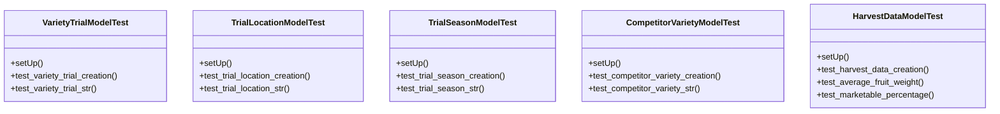

# agricultural_modules.variety_trials.tests.test_models

## Imports
- datetime
- django.contrib.auth
- django.test
- django.utils
- models

## Classes
- VarietyTrialModelTest
  - method: `setUp`
  - method: `test_variety_trial_creation`
  - method: `test_variety_trial_str`
- TrialLocationModelTest
  - method: `setUp`
  - method: `test_trial_location_creation`
  - method: `test_trial_location_str`
- TrialSeasonModelTest
  - method: `setUp`
  - method: `test_trial_season_creation`
  - method: `test_trial_season_str`
- CompetitorVarietyModelTest
  - method: `setUp`
  - method: `test_competitor_variety_creation`
  - method: `test_competitor_variety_str`
- HarvestDataModelTest
  - method: `setUp`
  - method: `test_harvest_data_creation`
  - method: `test_average_fruit_weight`
  - method: `test_marketable_percentage`

## Functions
- setUp
- test_variety_trial_creation
- test_variety_trial_str
- setUp
- test_trial_location_creation
- test_trial_location_str
- setUp
- test_trial_season_creation
- test_trial_season_str
- setUp
- test_competitor_variety_creation
- test_competitor_variety_str
- setUp
- test_harvest_data_creation
- test_average_fruit_weight
- test_marketable_percentage

## Module Variables
- `User`

## Class Diagram

