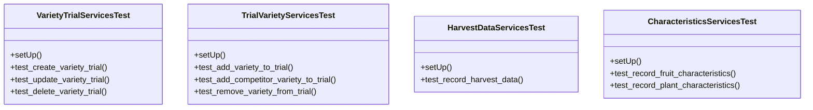

# agricultural_modules.variety_trials.tests.test_services

## Imports
- datetime
- django.contrib.auth
- django.test
- django.utils
- models
- services
- unittest.mock

## Classes
- VarietyTrialServicesTest
  - method: `setUp`
  - method: `test_create_variety_trial`
  - method: `test_update_variety_trial`
  - method: `test_delete_variety_trial`
- TrialVarietyServicesTest
  - method: `setUp`
  - method: `test_add_variety_to_trial`
  - method: `test_add_competitor_variety_to_trial`
  - method: `test_remove_variety_from_trial`
- HarvestDataServicesTest
  - method: `setUp`
  - method: `test_record_harvest_data`
- CharacteristicsServicesTest
  - method: `setUp`
  - method: `test_record_fruit_characteristics`
  - method: `test_record_plant_characteristics`

## Functions
- setUp
- test_create_variety_trial
- test_update_variety_trial
- test_delete_variety_trial
- setUp
- test_add_variety_to_trial
- test_add_competitor_variety_to_trial
- test_remove_variety_from_trial
- setUp
- test_record_harvest_data
- setUp
- test_record_fruit_characteristics
- test_record_plant_characteristics

## Module Variables
- `User`

## Class Diagram

