# agricultural_modules.variety_trials.views

## Imports
- django_filters.rest_framework
- models
- rest_framework
- rest_framework.decorators
- rest_framework.response
- serializers
- services

## Classes
- TrialLocationViewSet
  - attr: `queryset`
  - attr: `serializer_class`
  - attr: `permission_classes`
  - attr: `filter_backends`
  - attr: `filterset_fields`
  - attr: `search_fields`
  - attr: `ordering_fields`
- TrialSeasonViewSet
  - attr: `queryset`
  - attr: `serializer_class`
  - attr: `permission_classes`
  - attr: `filter_backends`
  - attr: `filterset_fields`
  - attr: `search_fields`
  - attr: `ordering_fields`
- CompetitorVarietyViewSet
  - attr: `queryset`
  - attr: `serializer_class`
  - attr: `permission_classes`
  - attr: `filter_backends`
  - attr: `filterset_fields`
  - attr: `search_fields`
  - attr: `ordering_fields`
- VarietyTrialViewSet
  - attr: `queryset`
  - attr: `permission_classes`
  - attr: `filter_backends`
  - attr: `filterset_fields`
  - attr: `search_fields`
  - attr: `ordering_fields`
  - method: `get_serializer_class`
  - method: `create`
  - method: `update`
  - method: `destroy`
  - method: `add_variety`
  - method: `remove_variety`
  - method: `record_harvest`
  - method: `record_fruit_characteristics`
  - method: `record_plant_characteristics`
  - method: `add_fertilization_program`
  - method: `add_pesticide_program`
  - method: `add_cost`
  - method: `statistics`
  - method: `compare_varieties`
  - method: `strengths_weaknesses`
  - method: `suggest_price`
  - method: `generate_report`
- TrialVarietyViewSet
  - attr: `queryset`
  - attr: `serializer_class`
  - attr: `permission_classes`
  - attr: `filter_backends`
  - attr: `filterset_fields`
  - attr: `search_fields`
  - attr: `ordering_fields`
- TrialReplicateViewSet
  - attr: `queryset`
  - attr: `serializer_class`
  - attr: `permission_classes`
  - attr: `filter_backends`
  - attr: `filterset_fields`
  - attr: `ordering_fields`
- HarvestDataViewSet
  - attr: `queryset`
  - attr: `serializer_class`
  - attr: `permission_classes`
  - attr: `filter_backends`
  - attr: `filterset_fields`
  - attr: `search_fields`
  - attr: `ordering_fields`
- FruitCharacteristicViewSet
  - attr: `queryset`
  - attr: `serializer_class`
  - attr: `permission_classes`
  - attr: `filter_backends`
  - attr: `filterset_fields`
  - attr: `search_fields`
  - attr: `ordering_fields`
- PlantCharacteristicViewSet
  - attr: `queryset`
  - attr: `serializer_class`
  - attr: `permission_classes`
  - attr: `filter_backends`
  - attr: `filterset_fields`
  - attr: `search_fields`
  - attr: `ordering_fields`
- TrialFertilizationProgramViewSet
  - attr: `queryset`
  - attr: `serializer_class`
  - attr: `permission_classes`
  - attr: `filter_backends`
  - attr: `filterset_fields`
  - attr: `search_fields`
  - attr: `ordering_fields`
- TrialPesticideProgramViewSet
  - attr: `queryset`
  - attr: `serializer_class`
  - attr: `permission_classes`
  - attr: `filter_backends`
  - attr: `filterset_fields`
  - attr: `search_fields`
  - attr: `ordering_fields`
- TrialCostViewSet
  - attr: `queryset`
  - attr: `serializer_class`
  - attr: `permission_classes`
  - attr: `filter_backends`
  - attr: `filterset_fields`
  - attr: `search_fields`
  - attr: `ordering_fields`
- TrialReportViewSet
  - attr: `queryset`
  - attr: `serializer_class`
  - attr: `permission_classes`
  - attr: `filter_backends`
  - attr: `filterset_fields`
  - attr: `search_fields`
  - attr: `ordering_fields`

## Functions
- get_serializer_class
- create
- update
- destroy
- add_variety
- remove_variety
- record_harvest
- record_fruit_characteristics
- record_plant_characteristics
- add_fertilization_program
- add_pesticide_program
- add_cost
- statistics
- compare_varieties
- strengths_weaknesses
- suggest_price
- generate_report

## Class Diagram

```mermaid
classDiagram
    class TrialLocationViewSet {
        +queryset
        +serializer_class
        +permission_classes
        +filter_backends
        +filterset_fields
        +... (2 more)
    }
    class TrialSeasonViewSet {
        +queryset
        +serializer_class
        +permission_classes
        +filter_backends
        +filterset_fields
        +... (2 more)
    }
    class CompetitorVarietyViewSet {
        +queryset
        +serializer_class
        +permission_classes
        +filter_backends
        +filterset_fields
        +... (2 more)
    }
    class VarietyTrialViewSet {
        +queryset
        +permission_classes
        +filter_backends
        +filterset_fields
        +search_fields
        +... (1 more)
        +get_serializer_class()
        +create()
        +update()
        +destroy()
        +add_variety()
        +... (12 more)
    }
    class TrialVarietyViewSet {
        +queryset
        +serializer_class
        +permission_classes
        +filter_backends
        +filterset_fields
        +... (2 more)
    }
    class TrialReplicateViewSet {
        +queryset
        +serializer_class
        +permission_classes
        +filter_backends
        +filterset_fields
        +... (1 more)
    }
    class HarvestDataViewSet {
        +queryset
        +serializer_class
        +permission_classes
        +filter_backends
        +filterset_fields
        +... (2 more)
    }
    class FruitCharacteristicViewSet {
        +queryset
        +serializer_class
        +permission_classes
        +filter_backends
        +filterset_fields
        +... (2 more)
    }
    class PlantCharacteristicViewSet {
        +queryset
        +serializer_class
        +permission_classes
        +filter_backends
        +filterset_fields
        +... (2 more)
    }
    class TrialFertilizationProgramViewSet {
        +queryset
        +serializer_class
        +permission_classes
        +filter_backends
        +filterset_fields
        +... (2 more)
    }
    class TrialPesticideProgramViewSet {
        +queryset
        +serializer_class
        +permission_classes
        +filter_backends
        +filterset_fields
        +... (2 more)
    }
    class TrialCostViewSet {
        +queryset
        +serializer_class
        +permission_classes
        +filter_backends
        +filterset_fields
        +... (2 more)
    }
    class TrialReportViewSet {
        +queryset
        +serializer_class
        +permission_classes
        +filter_backends
        +filterset_fields
        +... (2 more)
    }
```

