# ai_modules.ai_agents.models

## Imports
- django.conf
- django.core.exceptions
- django.core.validators
- django.db
- django.utils
- django.utils.translation
- json
- uuid

## Classes
- AIRole
  - attr: `ROLE_TYPE_CHOICES`
  - attr: `name`
  - attr: `description`
  - attr: `role_type`
  - attr: `is_active`
  - attr: `priority`
  - attr: `created_at`
  - attr: `updated_at`
  - attr: `created_by`
  - method: `__str__`
- AIPermission
  - attr: `PERMISSION_TYPE_CHOICES`
  - attr: `SCOPE_CHOICES`
  - attr: `name`
  - attr: `codename`
  - attr: `description`
  - attr: `permission_type`
  - attr: `scope`
  - attr: `module_name`
  - attr: `is_active`
  - attr: `created_at`
  - attr: `updated_at`
  - attr: `created_by`
  - method: `__str__`
- AIAgent
  - attr: `AGENT_TYPE_CHOICES`
  - attr: `STATUS_CHOICES`
  - attr: `MODEL_TYPE_CHOICES`
  - attr: `name`
  - attr: `code`
  - attr: `description`
  - attr: `agent_type`
  - attr: `status`
  - attr: `model_type`
  - attr: `model_config`
  - attr: `module_name`
  - attr: `specializations`
  - attr: `capabilities`
  - attr: `avatar_url`
  - attr: `avatar_config`
  - attr: `total_interactions`
  - attr: `successful_interactions`
  - attr: `average_response_time`
  - attr: `last_interaction`
  - attr: `owner`
  - attr: `is_system_agent`
  - attr: `is_public`
  - attr: `created_at`
  - attr: `updated_at`
  - attr: `created_by`
  - method: `__str__`
  - method: `get_success_rate`
  - method: `update_performance_stats`
- UserRole
  - attr: `user`
  - attr: `role`
  - attr: `assigned_at`
  - attr: `assigned_by`
  - attr: `is_active`
  - method: `__str__`
- AgentRole
  - attr: `agent`
  - attr: `role`
  - attr: `assigned_at`
  - attr: `assigned_by`
  - attr: `is_active`
  - method: `__str__`
- RolePermission
  - attr: `role`
  - attr: `permission`
  - attr: `granted_at`
  - attr: `granted_by`
  - attr: `is_active`
  - method: `__str__`
- AgentInteraction
  - attr: `INTERACTION_TYPE_CHOICES`
  - attr: `STATUS_CHOICES`
  - attr: `interaction_id`
  - attr: `user`
  - attr: `source_agent`
  - attr: `target_agent`
  - attr: `interaction_type`
  - attr: `status`
  - attr: `input_message`
  - attr: `output_message`
  - attr: `context_data`
  - attr: `started_at`
  - attr: `completed_at`
  - attr: `response_time`
  - attr: `session_id`
  - attr: `parent_interaction`
  - attr: `metadata`
  - method: `__str__`
  - method: `calculate_response_time`
  - method: `mark_completed`
  - method: `mark_failed`
- AgentMessage
  - attr: `MESSAGE_TYPE_CHOICES`
  - attr: `PRIORITY_CHOICES`
  - attr: `STATUS_CHOICES`
  - attr: `message_id`
  - attr: `sender_agent`
  - attr: `receiver_agent`
  - attr: `message_type`
  - attr: `priority`
  - attr: `status`
  - attr: `subject`
  - attr: `content`
  - attr: `payload`
  - attr: `created_at`
  - attr: `sent_at`
  - attr: `delivered_at`
  - attr: `processed_at`
  - attr: `expires_at`
  - attr: `interaction`
  - attr: `parent_message`
  - attr: `retry_count`
  - attr: `max_retries`
  - attr: `error_message`
  - method: `__str__`
  - method: `mark_sent`
  - method: `mark_delivered`
  - method: `mark_processed`
  - method: `mark_failed`
  - method: `can_retry`
  - method: `is_expired`
- AgentWorkflow
  - attr: `WORKFLOW_TYPE_CHOICES`
  - attr: `STATUS_CHOICES`
  - attr: `name`
  - attr: `description`
  - attr: `workflow_type`
  - attr: `status`
  - attr: `workflow_definition`
  - attr: `participating_agents`
  - attr: `trigger_conditions`
  - attr: `execution_count`
  - attr: `success_count`
  - attr: `last_execution`
  - attr: `owner`
  - attr: `is_system_workflow`
  - attr: `created_at`
  - attr: `updated_at`
  - method: `__str__`
  - method: `get_success_rate`
- AgentActivityLog
  - attr: `ACTIVITY_TYPE_CHOICES`
  - attr: `SEVERITY_CHOICES`
  - attr: `activity_type`
  - attr: `severity`
  - attr: `description`
  - attr: `user`
  - attr: `agent`
  - attr: `interaction`
  - attr: `workflow`
  - attr: `metadata`
  - attr: `ip_address`
  - attr: `user_agent`
  - attr: `timestamp`
  - method: `__str__`
- Meta
  - attr: `app_label`
  - attr: `verbose_name`
  - attr: `verbose_name_plural`
  - attr: `ordering`
  - attr: `indexes`
- Meta
  - attr: `app_label`
  - attr: `verbose_name`
  - attr: `verbose_name_plural`
  - attr: `ordering`
  - attr: `indexes`
- Meta
  - attr: `app_label`
  - attr: `verbose_name`
  - attr: `verbose_name_plural`
  - attr: `ordering`
  - attr: `indexes`
- Meta
  - attr: `app_label`
  - attr: `verbose_name`
  - attr: `verbose_name_plural`
  - attr: `unique_together`
  - attr: `indexes`
- Meta
  - attr: `app_label`
  - attr: `verbose_name`
  - attr: `verbose_name_plural`
  - attr: `unique_together`
  - attr: `indexes`
- Meta
  - attr: `app_label`
  - attr: `verbose_name`
  - attr: `verbose_name_plural`
  - attr: `unique_together`
  - attr: `indexes`
- Meta
  - attr: `app_label`
  - attr: `verbose_name`
  - attr: `verbose_name_plural`
  - attr: `ordering`
  - attr: `indexes`
- Meta
  - attr: `app_label`
  - attr: `verbose_name`
  - attr: `verbose_name_plural`
  - attr: `ordering`
  - attr: `indexes`
- Meta
  - attr: `app_label`
  - attr: `verbose_name`
  - attr: `verbose_name_plural`
  - attr: `ordering`
  - attr: `indexes`
- Meta
  - attr: `app_label`
  - attr: `verbose_name`
  - attr: `verbose_name_plural`
  - attr: `ordering`
  - attr: `indexes`

## Functions
- __str__
- __str__
- __str__
- get_success_rate
- update_performance_stats
- __str__
- __str__
- __str__
- __str__
- calculate_response_time
- mark_completed
- mark_failed
- __str__
- mark_sent
- mark_delivered
- mark_processed
- mark_failed
- can_retry
- is_expired
- __str__
- get_success_rate
- __str__

## Class Diagram

```mermaid
classDiagram
    class AIRole {
        +ROLE_TYPE_CHOICES
        +name
        +description
        +role_type
        +is_active
        +... (4 more)
        +__str__()
    }
    class AIPermission {
        +PERMISSION_TYPE_CHOICES
        +SCOPE_CHOICES
        +name
        +codename
        +description
        +... (7 more)
        +__str__()
    }
    class AIAgent {
        +AGENT_TYPE_CHOICES
        +STATUS_CHOICES
        +MODEL_TYPE_CHOICES
        +name
        +code
        +... (20 more)
        +__str__()
        +get_success_rate()
        +update_performance_stats()
    }
    class UserRole {
        +user
        +role
        +assigned_at
        +assigned_by
        +is_active
        +__str__()
    }
    class AgentRole {
        +agent
        +role
        +assigned_at
        +assigned_by
        +is_active
        +__str__()
    }
    class RolePermission {
        +role
        +permission
        +granted_at
        +granted_by
        +is_active
        +__str__()
    }
    class AgentInteraction {
        +INTERACTION_TYPE_CHOICES
        +STATUS_CHOICES
        +interaction_id
        +user
        +source_agent
        +... (12 more)
        +__str__()
        +calculate_response_time()
        +mark_completed()
        +mark_failed()
    }
    class AgentMessage {
        +MESSAGE_TYPE_CHOICES
        +PRIORITY_CHOICES
        +STATUS_CHOICES
        +message_id
        +sender_agent
        +... (17 more)
        +__str__()
        +mark_sent()
        +mark_delivered()
        +mark_processed()
        +mark_failed()
        +... (2 more)
    }
    class AgentWorkflow {
        +WORKFLOW_TYPE_CHOICES
        +STATUS_CHOICES
        +name
        +description
        +workflow_type
        +... (11 more)
        +__str__()
        +get_success_rate()
    }
    class AgentActivityLog {
        +ACTIVITY_TYPE_CHOICES
        +SEVERITY_CHOICES
        +activity_type
        +severity
        +description
        +... (8 more)
        +__str__()
    }
    class Meta {
        +app_label
        +verbose_name
        +verbose_name_plural
        +ordering
        +indexes
    }
    class Meta {
        +app_label
        +verbose_name
        +verbose_name_plural
        +ordering
        +indexes
    }
    class Meta {
        +app_label
        +verbose_name
        +verbose_name_plural
        +ordering
        +indexes
    }
    class Meta {
        +app_label
        +verbose_name
        +verbose_name_plural
        +unique_together
        +indexes
    }
    class Meta {
        +app_label
        +verbose_name
        +verbose_name_plural
        +unique_together
        +indexes
    }
    class Meta {
        +app_label
        +verbose_name
        +verbose_name_plural
        +unique_together
        +indexes
    }
    class Meta {
        +app_label
        +verbose_name
        +verbose_name_plural
        +ordering
        +indexes
    }
    class Meta {
        +app_label
        +verbose_name
        +verbose_name_plural
        +ordering
        +indexes
    }
    class Meta {
        +app_label
        +verbose_name
        +verbose_name_plural
        +ordering
        +indexes
    }
    class Meta {
        +app_label
        +verbose_name
        +verbose_name_plural
        +ordering
        +indexes
    }
    AIRole --> Meta
    AIRole --> Meta
    AIRole --> Meta
    AIRole --> Meta
    AIRole --> Meta
    AIRole --> Meta
    AIRole --> Meta
    AIRole --> Meta
    AIRole --> Meta
    AIRole --> Meta
    AIPermission --> Meta
    AIPermission --> Meta
    AIPermission --> Meta
    AIPermission --> Meta
    AIPermission --> Meta
    AIPermission --> Meta
    AIPermission --> Meta
    AIPermission --> Meta
    AIPermission --> Meta
    AIPermission --> Meta
    AIAgent --> Meta
    AIAgent --> Meta
    AIAgent --> Meta
    AIAgent --> Meta
    AIAgent --> Meta
    AIAgent --> Meta
    AIAgent --> Meta
    AIAgent --> Meta
    AIAgent --> Meta
    AIAgent --> Meta
    UserRole --> Meta
    UserRole --> Meta
    UserRole --> Meta
    UserRole --> Meta
    UserRole --> Meta
    UserRole --> Meta
    UserRole --> Meta
    UserRole --> Meta
    UserRole --> Meta
    UserRole --> Meta
    AgentRole --> Meta
    AgentRole --> Meta
    AgentRole --> Meta
    AgentRole --> Meta
    AgentRole --> Meta
    AgentRole --> Meta
    AgentRole --> Meta
    AgentRole --> Meta
    AgentRole --> Meta
    AgentRole --> Meta
    RolePermission --> Meta
    RolePermission --> Meta
    RolePermission --> Meta
    RolePermission --> Meta
    RolePermission --> Meta
    RolePermission --> Meta
    RolePermission --> Meta
    RolePermission --> Meta
    RolePermission --> Meta
    RolePermission --> Meta
    AgentInteraction --> Meta
    AgentInteraction --> Meta
    AgentInteraction --> Meta
    AgentInteraction --> Meta
    AgentInteraction --> Meta
    AgentInteraction --> Meta
    AgentInteraction --> Meta
    AgentInteraction --> Meta
    AgentInteraction --> Meta
    AgentInteraction --> Meta
    AgentMessage --> Meta
    AgentMessage --> Meta
    AgentMessage --> Meta
    AgentMessage --> Meta
    AgentMessage --> Meta
    AgentMessage --> Meta
    AgentMessage --> Meta
    AgentMessage --> Meta
    AgentMessage --> Meta
    AgentMessage --> Meta
    AgentWorkflow --> Meta
    AgentWorkflow --> Meta
    AgentWorkflow --> Meta
    AgentWorkflow --> Meta
    AgentWorkflow --> Meta
    AgentWorkflow --> Meta
    AgentWorkflow --> Meta
    AgentWorkflow --> Meta
    AgentWorkflow --> Meta
    AgentWorkflow --> Meta
    AgentActivityLog --> Meta
    AgentActivityLog --> Meta
    AgentActivityLog --> Meta
    AgentActivityLog --> Meta
    AgentActivityLog --> Meta
    AgentActivityLog --> Meta
    AgentActivityLog --> Meta
    AgentActivityLog --> Meta
    AgentActivityLog --> Meta
    AgentActivityLog --> Meta
```

