# ai_modules.ai_memory.admin

## Imports
- django.contrib
- django.urls
- django.utils.html
- django.utils.safestring
- django.utils.translation
- json
- models

## Classes
- MemoryTypeAdmin
  - attr: `list_display`
  - attr: `list_filter`
  - attr: `search_fields`
  - attr: `ordering`
  - attr: `readonly_fields`
  - attr: `fieldsets`
- MemoryContextAdmin
  - attr: `list_display`
  - attr: `list_filter`
  - attr: `search_fields`
  - attr: `ordering`
  - attr: `readonly_fields`
  - attr: `fieldsets`
  - method: `memory_count`
- MemoryAssociationInline
  - attr: `model`
  - attr: `fk_name`
  - attr: `extra`
  - attr: `readonly_fields`
- MemoryAdmin
  - attr: `list_display`
  - attr: `list_filter`
  - attr: `search_fields`
  - attr: `ordering`
  - attr: `readonly_fields`
  - attr: `inlines`
  - attr: `fieldsets`
  - method: `get_queryset`
- MemoryAssociationAdmin
  - attr: `list_display`
  - attr: `list_filter`
  - attr: `search_fields`
  - attr: `ordering`
  - attr: `readonly_fields`
  - attr: `fieldsets`
- KnowledgeBaseAdmin
  - attr: `list_display`
  - attr: `list_filter`
  - attr: `search_fields`
  - attr: `ordering`
  - attr: `readonly_fields`
  - attr: `fieldsets`
- LearningPatternAdmin
  - attr: `list_display`
  - attr: `list_filter`
  - attr: `search_fields`
  - attr: `ordering`
  - attr: `readonly_fields`
  - attr: `fieldsets`
  - method: `success_rate`
- MemoryCleanupLogAdmin
  - attr: `list_display`
  - attr: `list_filter`
  - attr: `search_fields`
  - attr: `ordering`
  - attr: `readonly_fields`
  - attr: `fieldsets`

## Functions
- memory_count
- get_queryset
- success_rate

## Class Diagram

```mermaid
classDiagram
    class MemoryTypeAdmin {
        +list_display
        +list_filter
        +search_fields
        +ordering
        +readonly_fields
        +... (1 more)
    }
    class MemoryContextAdmin {
        +list_display
        +list_filter
        +search_fields
        +ordering
        +readonly_fields
        +... (1 more)
        +memory_count()
    }
    class MemoryAssociationInline {
        +model
        +fk_name
        +extra
        +readonly_fields
    }
    class MemoryAdmin {
        +list_display
        +list_filter
        +search_fields
        +ordering
        +readonly_fields
        +... (2 more)
        +get_queryset()
    }
    class MemoryAssociationAdmin {
        +list_display
        +list_filter
        +search_fields
        +ordering
        +readonly_fields
        +... (1 more)
    }
    class KnowledgeBaseAdmin {
        +list_display
        +list_filter
        +search_fields
        +ordering
        +readonly_fields
        +... (1 more)
    }
    class LearningPatternAdmin {
        +list_display
        +list_filter
        +search_fields
        +ordering
        +readonly_fields
        +... (1 more)
        +success_rate()
    }
    class MemoryCleanupLogAdmin {
        +list_display
        +list_filter
        +search_fields
        +ordering
        +readonly_fields
        +... (1 more)
    }
```

