# ai_modules.ai_memory.filters

## Imports
- django.db.models
- django.utils.translation
- django_filters
- models
- types
- typing

## Classes
- MemoryFilter
  - attr: `search`
  - attr: `created_after`
  - attr: `created_before`
  - attr: `importance`
  - attr: `confidence`
  - attr: `validation_status`
  - attr: `is_expired`
  - attr: `has_keywords`
  - method: `filter_search`
  - method: `filter_expired`
  - method: `filter_keywords`
- MemoryContextFilter
  - attr: `search`
  - attr: `started_after`
  - attr: `started_before`
  - attr: `has_ended`
  - attr: `min_memories`
  - method: `filter_search`
  - method: `filter_ended`
  - method: `filter_min_memories`
- KnowledgeBaseFilter
  - attr: `search`
  - attr: `min_accuracy`
  - attr: `min_completeness`
  - attr: `min_reliability`
  - attr: `min_usage`
  - attr: `updated_after`
  - method: `filter_search`
- LearningPatternFilter
  - attr: `search`
  - attr: `min_confidence`
  - attr: `min_success_rate`
  - attr: `min_applied`
  - attr: `discovered_after`
  - method: `filter_search`
  - method: `filter_success_rate`
- Meta
  - attr: `model`
  - attr: `fields`
- Meta
  - attr: `model`
  - attr: `fields`
- Meta
  - attr: `model`
  - attr: `fields`
- Meta
  - attr: `model`
  - attr: `fields`
- FilterSet
- CharFilter
  - method: `__init__`
- DateTimeFilter
  - method: `__init__`
- BooleanFilter
  - method: `__init__`
- ChoiceFilter
  - method: `__init__`
- MultipleChoiceFilter
  - method: `__init__`
- NumberFilter
  - method: `__init__`
- _Q
  - method: `__init__`
  - method: `__or__`
  - method: `__and__`
- Memory
  - attr: `IMPORTANCE_CHOICES`
  - attr: `CONFIDENCE_CHOICES`
- MemoryContext
- KnowledgeBase
- LearningPattern

## Functions
- are_filters_available
- filter_search
- filter_expired
- filter_keywords
- filter_search
- filter_ended
- filter_min_memories
- filter_search
- filter_search
- filter_success_rate
- _
- __init__
- __init__
- __init__
- __init__
- __init__
- __init__
- __init__
- __or__
- __and__

## Module Variables
- `__all__`

## Class Diagram

```mermaid
classDiagram
    class MemoryFilter {
        +search
        +created_after
        +created_before
        +importance
        +confidence
        +... (3 more)
        +filter_search()
        +filter_expired()
        +filter_keywords()
    }
    class MemoryContextFilter {
        +search
        +started_after
        +started_before
        +has_ended
        +min_memories
        +filter_search()
        +filter_ended()
        +filter_min_memories()
    }
    class KnowledgeBaseFilter {
        +search
        +min_accuracy
        +min_completeness
        +min_reliability
        +min_usage
        +... (1 more)
        +filter_search()
    }
    class LearningPatternFilter {
        +search
        +min_confidence
        +min_success_rate
        +min_applied
        +discovered_after
        +filter_search()
        +filter_success_rate()
    }
    class Meta {
        +model
        +fields
    }
    class Meta {
        +model
        +fields
    }
    class Meta {
        +model
        +fields
    }
    class Meta {
        +model
        +fields
    }
    class FilterSet {
    }
    class CharFilter {
        +__init__()
    }
    class DateTimeFilter {
        +__init__()
    }
    class BooleanFilter {
        +__init__()
    }
    class ChoiceFilter {
        +__init__()
    }
    class MultipleChoiceFilter {
        +__init__()
    }
    class NumberFilter {
        +__init__()
    }
    class _Q {
        +__init__()
        +__or__()
        +__and__()
    }
    class Memory {
        +IMPORTANCE_CHOICES
        +CONFIDENCE_CHOICES
    }
    class MemoryContext {
    }
    class KnowledgeBase {
    }
    class LearningPattern {
    }
    MemoryFilter --> Meta
    MemoryFilter --> Meta
    MemoryFilter --> Meta
    MemoryFilter --> Meta
    MemoryContextFilter --> Meta
    MemoryContextFilter --> Meta
    MemoryContextFilter --> Meta
    MemoryContextFilter --> Meta
    KnowledgeBaseFilter --> Meta
    KnowledgeBaseFilter --> Meta
    KnowledgeBaseFilter --> Meta
    KnowledgeBaseFilter --> Meta
    LearningPatternFilter --> Meta
    LearningPatternFilter --> Meta
    LearningPatternFilter --> Meta
    LearningPatternFilter --> Meta
    FilterSet --> Meta
    FilterSet --> Meta
    FilterSet --> Meta
    FilterSet --> Meta
    CharFilter --> Meta
    CharFilter --> Meta
    CharFilter --> Meta
    CharFilter --> Meta
    DateTimeFilter --> Meta
    DateTimeFilter --> Meta
    DateTimeFilter --> Meta
    DateTimeFilter --> Meta
    BooleanFilter --> Meta
    BooleanFilter --> Meta
    BooleanFilter --> Meta
    BooleanFilter --> Meta
    ChoiceFilter --> Meta
    ChoiceFilter --> Meta
    ChoiceFilter --> Meta
    ChoiceFilter --> Meta
    MultipleChoiceFilter --> Meta
    MultipleChoiceFilter --> Meta
    MultipleChoiceFilter --> Meta
    MultipleChoiceFilter --> Meta
    NumberFilter --> Meta
    NumberFilter --> Meta
    NumberFilter --> Meta
    NumberFilter --> Meta
    _Q --> Meta
    _Q --> Meta
    _Q --> Meta
    _Q --> Meta
    Memory --> Meta
    Memory --> Meta
    Memory --> Meta
    Memory --> Meta
    MemoryContext --> Meta
    MemoryContext --> Meta
    MemoryContext --> Meta
    MemoryContext --> Meta
    KnowledgeBase --> Meta
    KnowledgeBase --> Meta
    KnowledgeBase --> Meta
    KnowledgeBase --> Meta
    LearningPattern --> Meta
    LearningPattern --> Meta
    LearningPattern --> Meta
    LearningPattern --> Meta
```

