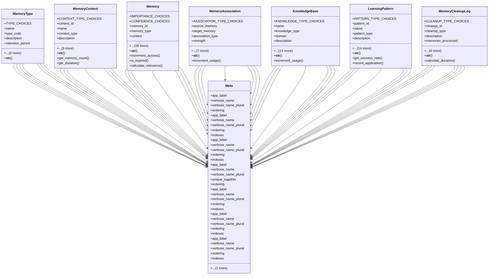

# ai_modules.ai_memory.models

## Imports
- django.conf
- django.core.exceptions
- django.core.validators
- django.db
- django.utils
- django.utils.translation
- json
- uuid

## Classes
- MemoryType
  - attr: `TYPE_CHOICES`
  - attr: `name`
  - attr: `type_code`
  - attr: `description`
  - attr: `retention_period`
  - attr: `max_capacity`
  - attr: `priority`
  - attr: `is_active`
  - attr: `created_at`
  - attr: `updated_at`
  - method: `__str__`
- MemoryContext
  - attr: `CONTEXT_TYPE_CHOICES`
  - attr: `context_id`
  - attr: `name`
  - attr: `context_type`
  - attr: `description`
  - attr: `user`
  - attr: `agent_id`
  - attr: `metadata`
  - attr: `tags`
  - attr: `started_at`
  - attr: `ended_at`
  - attr: `last_accessed`
  - attr: `is_active`
  - attr: `is_archived`
  - method: `__str__`
  - method: `get_memory_count`
  - method: `get_duration`
- Memory
  - attr: `IMPORTANCE_CHOICES`
  - attr: `CONFIDENCE_CHOICES`
  - attr: `memory_id`
  - attr: `memory_type`
  - attr: `context`
  - attr: `title`
  - attr: `content`
  - attr: `summary`
  - attr: `structured_data`
  - attr: `keywords`
  - attr: `entities`
  - attr: `importance`
  - attr: `confidence`
  - attr: `relevance_score`
  - attr: `access_count`
  - attr: `last_accessed`
  - attr: `learned_from`
  - attr: `validation_status`
  - attr: `expires_at`
  - attr: `is_permanent`
  - attr: `created_at`
  - attr: `updated_at`
  - attr: `created_by`
  - method: `__str__`
  - method: `increment_access`
  - method: `is_expired`
  - method: `calculate_relevance`
- MemoryAssociation
  - attr: `ASSOCIATION_TYPE_CHOICES`
  - attr: `source_memory`
  - attr: `target_memory`
  - attr: `association_type`
  - attr: `strength`
  - attr: `description`
  - attr: `learned_automatically`
  - attr: `confidence`
  - attr: `usage_count`
  - attr: `last_used`
  - attr: `created_at`
  - attr: `updated_at`
  - method: `__str__`
  - method: `increment_usage`
- KnowledgeBase
  - attr: `KNOWLEDGE_TYPE_CHOICES`
  - attr: `name`
  - attr: `knowledge_type`
  - attr: `domain`
  - attr: `description`
  - attr: `content`
  - attr: `rules`
  - attr: `examples`
  - attr: `accuracy`
  - attr: `completeness`
  - attr: `reliability`
  - attr: `usage_count`
  - attr: `last_used`
  - attr: `version`
  - attr: `last_updated_by`
  - attr: `is_active`
  - attr: `created_at`
  - attr: `updated_at`
  - method: `__str__`
  - method: `increment_usage`
- LearningPattern
  - attr: `PATTERN_TYPE_CHOICES`
  - attr: `pattern_id`
  - attr: `name`
  - attr: `pattern_type`
  - attr: `description`
  - attr: `user`
  - attr: `agent_id`
  - attr: `pattern_data`
  - attr: `conditions`
  - attr: `actions`
  - attr: `confidence`
  - attr: `support`
  - attr: `frequency`
  - attr: `applied_count`
  - attr: `success_count`
  - attr: `last_applied`
  - attr: `is_active`
  - attr: `discovered_at`
  - attr: `updated_at`
  - method: `__str__`
  - method: `get_success_rate`
  - method: `record_application`
- MemoryCleanupLog
  - attr: `CLEANUP_TYPE_CHOICES`
  - attr: `cleanup_id`
  - attr: `cleanup_type`
  - attr: `description`
  - attr: `memories_processed`
  - attr: `memories_deleted`
  - attr: `memories_archived`
  - attr: `space_freed`
  - attr: `started_at`
  - attr: `completed_at`
  - attr: `duration`
  - attr: `executed_by`
  - attr: `is_successful`
  - attr: `error_message`
  - method: `__str__`
  - method: `calculate_duration`
- Meta
  - attr: `app_label`
  - attr: `verbose_name`
  - attr: `verbose_name_plural`
  - attr: `ordering`
- Meta
  - attr: `app_label`
  - attr: `verbose_name`
  - attr: `verbose_name_plural`
  - attr: `ordering`
  - attr: `indexes`
- Meta
  - attr: `app_label`
  - attr: `verbose_name`
  - attr: `verbose_name_plural`
  - attr: `ordering`
  - attr: `indexes`
- Meta
  - attr: `app_label`
  - attr: `verbose_name`
  - attr: `verbose_name_plural`
  - attr: `unique_together`
  - attr: `ordering`
  - attr: `indexes`
- Meta
  - attr: `app_label`
  - attr: `verbose_name`
  - attr: `verbose_name_plural`
  - attr: `ordering`
  - attr: `indexes`
- Meta
  - attr: `app_label`
  - attr: `verbose_name`
  - attr: `verbose_name_plural`
  - attr: `ordering`
  - attr: `indexes`
- Meta
  - attr: `app_label`
  - attr: `verbose_name`
  - attr: `verbose_name_plural`
  - attr: `ordering`
  - attr: `indexes`

## Functions
- __str__
- __str__
- get_memory_count
- get_duration
- __str__
- increment_access
- is_expired
- calculate_relevance
- __str__
- increment_usage
- __str__
- increment_usage
- __str__
- get_success_rate
- record_application
- __str__
- calculate_duration

## Class Diagram

