# ai_modules.ai_memory.serializers

## Imports
- django.utils.translation
- models
- rest_framework

## Classes
- MemoryTypeSerializer
- MemoryContextSerializer
  - attr: `memory_count`
  - attr: `duration`
- MemoryAssociationSerializer
  - attr: `source_memory_title`
  - attr: `target_memory_title`
- MemorySerializer
  - attr: `memory_type_name`
  - attr: `context_name`
  - attr: `is_expired`
  - attr: `outgoing_associations`
  - attr: `incoming_associations`
  - method: `validate_keywords`
  - method: `validate_entities`
- KnowledgeBaseSerializer
  - method: `validate_content`
  - method: `validate_rules`
- LearningPatternSerializer
  - attr: `success_rate`
  - method: `validate_pattern_data`
- MemoryCleanupLogSerializer
- MemoryListSerializer
  - attr: `memory_type_name`
  - attr: `context_name`
- MemoryContextListSerializer
  - attr: `memory_count`
- KnowledgeBaseListSerializer
- Meta
  - attr: `model`
  - attr: `fields`
  - attr: `read_only_fields`
- Meta
  - attr: `model`
  - attr: `fields`
  - attr: `read_only_fields`
- Meta
  - attr: `model`
  - attr: `fields`
  - attr: `read_only_fields`
- Meta
  - attr: `model`
  - attr: `fields`
  - attr: `read_only_fields`
- Meta
  - attr: `model`
  - attr: `fields`
  - attr: `read_only_fields`
- Meta
  - attr: `model`
  - attr: `fields`
  - attr: `read_only_fields`
- Meta
  - attr: `model`
  - attr: `fields`
  - attr: `read_only_fields`
- Meta
  - attr: `model`
  - attr: `fields`
- Meta
  - attr: `model`
  - attr: `fields`
- Meta
  - attr: `model`
  - attr: `fields`
- ValidationError
  - method: `__init__`
- ReadOnlyField
  - method: `__init__`
- ModelSerializer
  - method: `__init__`
  - method: `validate_keywords`
  - method: `validate_entities`
  - method: `validate_content`
  - method: `validate_rules`
  - method: `validate_pattern_data`
- serializers
  - attr: `ModelSerializer`
  - attr: `ReadOnlyField`
  - attr: `ValidationError`
- MemoryType
- MemoryContext
- Memory
- MemoryAssociation
- KnowledgeBase
- LearningPattern
- MemoryCleanupLog
- Meta
  - attr: `model`
  - attr: `fields`
  - attr: `read_only_fields`

## Functions
- are_serializers_available
- validate_keywords
- validate_entities
- validate_content
- validate_rules
- validate_pattern_data
- _
- __init__
- __init__
- __init__
- validate_keywords
- validate_entities
- validate_content
- validate_rules
- validate_pattern_data

## Module Variables
- `__all__`

## Class Diagram

```mermaid
classDiagram
    class MemoryTypeSerializer {
    }
    class MemoryContextSerializer {
        +memory_count
        +duration
    }
    class MemoryAssociationSerializer {
        +source_memory_title
        +target_memory_title
    }
    class MemorySerializer {
        +memory_type_name
        +context_name
        +is_expired
        +outgoing_associations
        +incoming_associations
        +validate_keywords()
        +validate_entities()
    }
    class KnowledgeBaseSerializer {
        +validate_content()
        +validate_rules()
    }
    class LearningPatternSerializer {
        +success_rate
        +validate_pattern_data()
    }
    class MemoryCleanupLogSerializer {
    }
    class MemoryListSerializer {
        +memory_type_name
        +context_name
    }
    class MemoryContextListSerializer {
        +memory_count
    }
    class KnowledgeBaseListSerializer {
    }
    class Meta {
        +model
        +fields
        +read_only_fields
    }
    class Meta {
        +model
        +fields
        +read_only_fields
    }
    class Meta {
        +model
        +fields
        +read_only_fields
    }
    class Meta {
        +model
        +fields
        +read_only_fields
    }
    class Meta {
        +model
        +fields
        +read_only_fields
    }
    class Meta {
        +model
        +fields
        +read_only_fields
    }
    class Meta {
        +model
        +fields
        +read_only_fields
    }
    class Meta {
        +model
        +fields
    }
    class Meta {
        +model
        +fields
    }
    class Meta {
        +model
        +fields
    }
    class ValidationError {
        +__init__()
    }
    class ReadOnlyField {
        +__init__()
    }
    class ModelSerializer {
        +__init__()
        +validate_keywords()
        +validate_entities()
        +validate_content()
        +validate_rules()
        +... (1 more)
    }
    class serializers {
        +ModelSerializer
        +ReadOnlyField
        +ValidationError
    }
    class MemoryType {
    }
    class MemoryContext {
    }
    class Memory {
    }
    class MemoryAssociation {
    }
    class KnowledgeBase {
    }
    class LearningPattern {
    }
    class MemoryCleanupLog {
    }
    class Meta {
        +model
        +fields
        +read_only_fields
    }
    MemoryTypeSerializer --> Meta
    MemoryTypeSerializer --> Meta
    MemoryTypeSerializer --> Meta
    MemoryTypeSerializer --> Meta
    MemoryTypeSerializer --> Meta
    MemoryTypeSerializer --> Meta
    MemoryTypeSerializer --> Meta
    MemoryTypeSerializer --> Meta
    MemoryTypeSerializer --> Meta
    MemoryTypeSerializer --> Meta
    MemoryTypeSerializer --> Meta
    MemoryContextSerializer --> Meta
    MemoryContextSerializer --> Meta
    MemoryContextSerializer --> Meta
    MemoryContextSerializer --> Meta
    MemoryContextSerializer --> Meta
    MemoryContextSerializer --> Meta
    MemoryContextSerializer --> Meta
    MemoryContextSerializer --> Meta
    MemoryContextSerializer --> Meta
    MemoryContextSerializer --> Meta
    MemoryContextSerializer --> Meta
    MemoryAssociationSerializer --> Meta
    MemoryAssociationSerializer --> Meta
    MemoryAssociationSerializer --> Meta
    MemoryAssociationSerializer --> Meta
    MemoryAssociationSerializer --> Meta
    MemoryAssociationSerializer --> Meta
    MemoryAssociationSerializer --> Meta
    MemoryAssociationSerializer --> Meta
    MemoryAssociationSerializer --> Meta
    MemoryAssociationSerializer --> Meta
    MemoryAssociationSerializer --> Meta
    MemorySerializer --> Meta
    MemorySerializer --> Meta
    MemorySerializer --> Meta
    MemorySerializer --> Meta
    MemorySerializer --> Meta
    MemorySerializer --> Meta
    MemorySerializer --> Meta
    MemorySerializer --> Meta
    MemorySerializer --> Meta
    MemorySerializer --> Meta
    MemorySerializer --> Meta
    KnowledgeBaseSerializer --> Meta
    KnowledgeBaseSerializer --> Meta
    KnowledgeBaseSerializer --> Meta
    KnowledgeBaseSerializer --> Meta
    KnowledgeBaseSerializer --> Meta
    KnowledgeBaseSerializer --> Meta
    KnowledgeBaseSerializer --> Meta
    KnowledgeBaseSerializer --> Meta
    KnowledgeBaseSerializer --> Meta
    KnowledgeBaseSerializer --> Meta
    KnowledgeBaseSerializer --> Meta
    LearningPatternSerializer --> Meta
    LearningPatternSerializer --> Meta
    LearningPatternSerializer --> Meta
    LearningPatternSerializer --> Meta
    LearningPatternSerializer --> Meta
    LearningPatternSerializer --> Meta
    LearningPatternSerializer --> Meta
    LearningPatternSerializer --> Meta
    LearningPatternSerializer --> Meta
    LearningPatternSerializer --> Meta
    LearningPatternSerializer --> Meta
    MemoryCleanupLogSerializer --> Meta
    MemoryCleanupLogSerializer --> Meta
    MemoryCleanupLogSerializer --> Meta
    MemoryCleanupLogSerializer --> Meta
    MemoryCleanupLogSerializer --> Meta
    MemoryCleanupLogSerializer --> Meta
    MemoryCleanupLogSerializer --> Meta
    MemoryCleanupLogSerializer --> Meta
    MemoryCleanupLogSerializer --> Meta
    MemoryCleanupLogSerializer --> Meta
    MemoryCleanupLogSerializer --> Meta
    MemoryListSerializer --> Meta
    MemoryListSerializer --> Meta
    MemoryListSerializer --> Meta
    MemoryListSerializer --> Meta
    MemoryListSerializer --> Meta
    MemoryListSerializer --> Meta
    MemoryListSerializer --> Meta
    MemoryListSerializer --> Meta
    MemoryListSerializer --> Meta
    MemoryListSerializer --> Meta
    MemoryListSerializer --> Meta
    MemoryContextListSerializer --> Meta
    MemoryContextListSerializer --> Meta
    MemoryContextListSerializer --> Meta
    MemoryContextListSerializer --> Meta
    MemoryContextListSerializer --> Meta
    MemoryContextListSerializer --> Meta
    MemoryContextListSerializer --> Meta
    MemoryContextListSerializer --> Meta
    MemoryContextListSerializer --> Meta
    MemoryContextListSerializer --> Meta
    MemoryContextListSerializer --> Meta
    KnowledgeBaseListSerializer --> Meta
    KnowledgeBaseListSerializer --> Meta
    KnowledgeBaseListSerializer --> Meta
    KnowledgeBaseListSerializer --> Meta
    KnowledgeBaseListSerializer --> Meta
    KnowledgeBaseListSerializer --> Meta
    KnowledgeBaseListSerializer --> Meta
    KnowledgeBaseListSerializer --> Meta
    KnowledgeBaseListSerializer --> Meta
    KnowledgeBaseListSerializer --> Meta
    KnowledgeBaseListSerializer --> Meta
    ValidationError --> Meta
    ValidationError --> Meta
    ValidationError --> Meta
    ValidationError --> Meta
    ValidationError --> Meta
    ValidationError --> Meta
    ValidationError --> Meta
    ValidationError --> Meta
    ValidationError --> Meta
    ValidationError --> Meta
    ValidationError --> Meta
    ReadOnlyField --> Meta
    ReadOnlyField --> Meta
    ReadOnlyField --> Meta
    ReadOnlyField --> Meta
    ReadOnlyField --> Meta
    ReadOnlyField --> Meta
    ReadOnlyField --> Meta
    ReadOnlyField --> Meta
    ReadOnlyField --> Meta
    ReadOnlyField --> Meta
    ReadOnlyField --> Meta
    ModelSerializer --> Meta
    ModelSerializer --> Meta
    ModelSerializer --> Meta
    ModelSerializer --> Meta
    ModelSerializer --> Meta
    ModelSerializer --> Meta
    ModelSerializer --> Meta
    ModelSerializer --> Meta
    ModelSerializer --> Meta
    ModelSerializer --> Meta
    ModelSerializer --> Meta
    serializers --> Meta
    serializers --> Meta
    serializers --> Meta
    serializers --> Meta
    serializers --> Meta
    serializers --> Meta
    serializers --> Meta
    serializers --> Meta
    serializers --> Meta
    serializers --> Meta
    serializers --> Meta
    MemoryType --> Meta
    MemoryType --> Meta
    MemoryType --> Meta
    MemoryType --> Meta
    MemoryType --> Meta
    MemoryType --> Meta
    MemoryType --> Meta
    MemoryType --> Meta
    MemoryType --> Meta
    MemoryType --> Meta
    MemoryType --> Meta
    MemoryContext --> Meta
    MemoryContext --> Meta
    MemoryContext --> Meta
    MemoryContext --> Meta
    MemoryContext --> Meta
    MemoryContext --> Meta
    MemoryContext --> Meta
    MemoryContext --> Meta
    MemoryContext --> Meta
    MemoryContext --> Meta
    MemoryContext --> Meta
    Memory --> Meta
    Memory --> Meta
    Memory --> Meta
    Memory --> Meta
    Memory --> Meta
    Memory --> Meta
    Memory --> Meta
    Memory --> Meta
    Memory --> Meta
    Memory --> Meta
    Memory --> Meta
    MemoryAssociation --> Meta
    MemoryAssociation --> Meta
    MemoryAssociation --> Meta
    MemoryAssociation --> Meta
    MemoryAssociation --> Meta
    MemoryAssociation --> Meta
    MemoryAssociation --> Meta
    MemoryAssociation --> Meta
    MemoryAssociation --> Meta
    MemoryAssociation --> Meta
    MemoryAssociation --> Meta
    KnowledgeBase --> Meta
    KnowledgeBase --> Meta
    KnowledgeBase --> Meta
    KnowledgeBase --> Meta
    KnowledgeBase --> Meta
    KnowledgeBase --> Meta
    KnowledgeBase --> Meta
    KnowledgeBase --> Meta
    KnowledgeBase --> Meta
    KnowledgeBase --> Meta
    KnowledgeBase --> Meta
    LearningPattern --> Meta
    LearningPattern --> Meta
    LearningPattern --> Meta
    LearningPattern --> Meta
    LearningPattern --> Meta
    LearningPattern --> Meta
    LearningPattern --> Meta
    LearningPattern --> Meta
    LearningPattern --> Meta
    LearningPattern --> Meta
    LearningPattern --> Meta
    MemoryCleanupLog --> Meta
    MemoryCleanupLog --> Meta
    MemoryCleanupLog --> Meta
    MemoryCleanupLog --> Meta
    MemoryCleanupLog --> Meta
    MemoryCleanupLog --> Meta
    MemoryCleanupLog --> Meta
    MemoryCleanupLog --> Meta
    MemoryCleanupLog --> Meta
    MemoryCleanupLog --> Meta
    MemoryCleanupLog --> Meta
```

