# ai_modules.ai_memory.services

## Imports
- datetime
- django.contrib.auth
- django.core.exceptions
- django.db.models
- django.utils
- django.utils.translation
- json
- models
- typing
- uuid

## Classes
- MemoryService
  - method: `create_memory`
  - method: `search_memories`
  - method: `create_association`
  - method: `find_related_memories`
  - method: `update_relevance_scores`
- KnowledgeService
  - method: `create_knowledge_base`
  - method: `search_knowledge`
  - method: `apply_knowledge`
  - method: `_check_rule_conditions`
- LearningService
  - method: `discover_patterns`
  - method: `_discover_temporal_patterns`
  - method: `_discover_preference_patterns`
- User
  - attr: `is_staff`
- Q
  - method: `__init__`
  - method: `__or__`
  - method: `__and__`
- Count
  - method: `__init__`
- Avg
  - method: `__init__`
- F
  - method: `__init__`
- ValidationError
  - method: `__init__`
- timezone
  - method: `now`
- MemoryType
  - attr: `objects`
- MemoryContext
  - attr: `objects`
  - attr: `last_accessed`
  - attr: `memories`
  - method: `save`
- Memory
  - attr: `objects`
  - attr: `outgoing_associations`
  - attr: `incoming_associations`
  - attr: `relevance_score`
  - method: `calculate_relevance`
  - method: `save`
- MemoryAssociation
  - attr: `objects`
- KnowledgeBase
  - attr: `objects`
  - attr: `rules`
  - attr: `name`
  - attr: `domain`
  - attr: `accuracy`
  - method: `increment_usage`
- LearningPattern
  - attr: `objects`
- MemoryCleanupLog
  - attr: `objects`
- User
- objects
  - method: `get`
- objects
  - method: `get`
- objects
  - method: `create`
  - method: `all`
  - method: `filter`
  - method: `order_by`
  - method: `__getitem__`
- outgoing_associations
  - method: `select_related`
  - method: `order_by`
- incoming_associations
  - method: `select_related`
  - method: `order_by`
- objects
  - method: `create`
  - method: `filter`
  - method: `first`
- objects
  - method: `create`
  - method: `filter`
  - method: `order_by`
  - method: `__getitem__`
- objects
  - method: `create`

## Functions
- are_services_available
- create_memory
- search_memories
- create_association
- find_related_memories
- update_relevance_scores
- create_knowledge_base
- search_knowledge
- apply_knowledge
- _check_rule_conditions
- discover_patterns
- _discover_temporal_patterns
- _discover_preference_patterns
- _
- get_user_model
- __init__
- __or__
- __and__
- __init__
- __init__
- __init__
- __init__
- now
- save
- calculate_relevance
- save
- increment_usage
- get
- get
- create
- all
- filter
- order_by
- __getitem__
- select_related
- order_by
- select_related
- order_by
- create
- filter
- first
- create
- filter
- order_by
- __getitem__
- create

## Module Variables
- `__all__`

## Class Diagram

```mermaid
classDiagram
    class MemoryService {
        +create_memory()
        +search_memories()
        +create_association()
        +find_related_memories()
        +update_relevance_scores()
    }
    class KnowledgeService {
        +create_knowledge_base()
        +search_knowledge()
        +apply_knowledge()
        +_check_rule_conditions()
    }
    class LearningService {
        +discover_patterns()
        +_discover_temporal_patterns()
        +_discover_preference_patterns()
    }
    class User {
        +is_staff
    }
    class Q {
        +__init__()
        +__or__()
        +__and__()
    }
    class Count {
        +__init__()
    }
    class Avg {
        +__init__()
    }
    class F {
        +__init__()
    }
    class ValidationError {
        +__init__()
    }
    class timezone {
        +now()
    }
    class MemoryType {
        +objects
    }
    class MemoryContext {
        +objects
        +last_accessed
        +memories
        +save()
    }
    class Memory {
        +objects
        +outgoing_associations
        +incoming_associations
        +relevance_score
        +calculate_relevance()
        +save()
    }
    class MemoryAssociation {
        +objects
    }
    class KnowledgeBase {
        +objects
        +rules
        +name
        +domain
        +accuracy
        +increment_usage()
    }
    class LearningPattern {
        +objects
    }
    class MemoryCleanupLog {
        +objects
    }
    class User {
    }
    class objects {
        +get()
    }
    class objects {
        +get()
    }
    class objects {
        +create()
        +all()
        +filter()
        +order_by()
        +__getitem__()
    }
    class outgoing_associations {
        +select_related()
        +order_by()
    }
    class incoming_associations {
        +select_related()
        +order_by()
    }
    class objects {
        +create()
        +filter()
        +first()
    }
    class objects {
        +create()
        +filter()
        +order_by()
        +__getitem__()
    }
    class objects {
        +create()
    }
```

