# ai_modules.ai_memory.tests

## Imports
- datetime
- django.contrib.auth
- django.test
- django.utils
- models
- services
- uuid

## Classes
- MemoryTypeTestCase
  - method: `setUp`
  - method: `test_memory_type_creation`
  - method: `test_memory_type_str`
- MemoryContextTestCase
  - method: `setUp`
  - method: `test_context_creation`
  - method: `test_context_memory_count`
  - method: `test_context_duration`
- MemoryTestCase
  - method: `setUp`
  - method: `test_memory_creation`
  - method: `test_memory_access_increment`
  - method: `test_memory_expiration`
  - method: `test_relevance_calculation`
- MemoryAssociationTestCase
  - method: `setUp`
  - method: `test_association_creation`
  - method: `test_association_usage_increment`
- MemoryServiceTestCase
  - method: `setUp`
  - method: `test_create_memory`
  - method: `test_search_memories`
- KnowledgeServiceTestCase
  - method: `setUp`
  - method: `test_search_knowledge`
  - method: `test_apply_knowledge`
- LearningServiceTestCase
  - method: `setUp`
  - method: `test_discover_patterns`

## Functions
- setUp
- test_memory_type_creation
- test_memory_type_str
- setUp
- test_context_creation
- test_context_memory_count
- test_context_duration
- setUp
- test_memory_creation
- test_memory_access_increment
- test_memory_expiration
- test_relevance_calculation
- setUp
- test_association_creation
- test_association_usage_increment
- setUp
- test_create_memory
- test_search_memories
- setUp
- test_search_knowledge
- test_apply_knowledge
- setUp
- test_discover_patterns

## Module Variables
- `User`

## Class Diagram

```mermaid
classDiagram
    class MemoryTypeTestCase {
        +setUp()
        +test_memory_type_creation()
        +test_memory_type_str()
    }
    class MemoryContextTestCase {
        +setUp()
        +test_context_creation()
        +test_context_memory_count()
        +test_context_duration()
    }
    class MemoryTestCase {
        +setUp()
        +test_memory_creation()
        +test_memory_access_increment()
        +test_memory_expiration()
        +test_relevance_calculation()
    }
    class MemoryAssociationTestCase {
        +setUp()
        +test_association_creation()
        +test_association_usage_increment()
    }
    class MemoryServiceTestCase {
        +setUp()
        +test_create_memory()
        +test_search_memories()
    }
    class KnowledgeServiceTestCase {
        +setUp()
        +test_search_knowledge()
        +test_apply_knowledge()
    }
    class LearningServiceTestCase {
        +setUp()
        +test_discover_patterns()
    }
```

