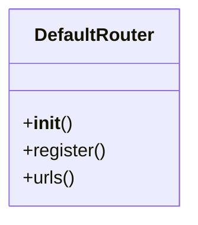

# ai_modules.ai_memory.urls

## Imports
- django.urls
- rest_framework.routers
- views

## Classes
- DefaultRouter
  - method: `__init__`
  - method: `register`
  - method: `urls`

## Functions
- __init__
- register
- urls

## Module Variables
- `app_name`
- `router`
- `urlpatterns`

## Class Diagram

