# ai_modules.ai_memory.views

## Imports
- django.db.models
- django.utils
- django.utils.translation
- django_filters.rest_framework
- filters
- models
- rest_framework
- rest_framework.decorators
- rest_framework.filters
- rest_framework.response
- serializers
- services

## Classes
- MemoryTypeViewSet
  - attr: `queryset`
  - attr: `serializer_class`
  - attr: `permission_classes`
  - attr: `filter_backends`
  - attr: `filterset_fields`
  - attr: `search_fields`
  - attr: `ordering_fields`
  - attr: `ordering`
- MemoryContextViewSet
  - attr: `queryset`
  - attr: `serializer_class`
  - attr: `permission_classes`
  - attr: `filter_backends`
  - attr: `filterset_class`
  - attr: `search_fields`
  - attr: `ordering_fields`
  - attr: `ordering`
  - method: `get_serializer_class`
  - method: `get_queryset`
  - method: `end_context`
  - method: `archive_context`
- MemoryViewSet
  - attr: `queryset`
  - attr: `serializer_class`
  - attr: `permission_classes`
  - attr: `filter_backends`
  - attr: `filterset_class`
  - attr: `search_fields`
  - attr: `ordering_fields`
  - attr: `ordering`
  - method: `get_serializer_class`
  - method: `get_queryset`
  - method: `perform_create`
  - method: `access_memory`
  - method: `associations`
  - method: `search_memories`
  - method: `calculate_relevance`
- MemoryAssociationViewSet
  - attr: `queryset`
  - attr: `serializer_class`
  - attr: `permission_classes`
  - attr: `filter_backends`
  - attr: `filterset_fields`
  - attr: `search_fields`
  - attr: `ordering_fields`
  - attr: `ordering`
  - method: `use_association`
- KnowledgeBaseViewSet
  - attr: `queryset`
  - attr: `serializer_class`
  - attr: `permission_classes`
  - attr: `filter_backends`
  - attr: `filterset_class`
  - attr: `search_fields`
  - attr: `ordering_fields`
  - attr: `ordering`
  - method: `get_serializer_class`
  - method: `perform_update`
  - method: `use_knowledge`
  - method: `search_knowledge`
- LearningPatternViewSet
  - attr: `queryset`
  - attr: `serializer_class`
  - attr: `permission_classes`
  - attr: `filter_backends`
  - attr: `filterset_fields`
  - attr: `search_fields`
  - attr: `ordering_fields`
  - attr: `ordering`
  - method: `get_queryset`
  - method: `apply_pattern`
  - method: `discover_patterns`
- MemoryCleanupLogViewSet
  - attr: `queryset`
  - attr: `serializer_class`
  - attr: `permission_classes`
  - attr: `filter_backends`
  - attr: `filterset_fields`
  - attr: `search_fields`
  - attr: `ordering_fields`
  - attr: `ordering`
  - method: `statistics`
- DjangoFilterBackend
- SearchFilter
- OrderingFilter

## Functions
- get_serializer_class
- get_queryset
- end_context
- archive_context
- get_serializer_class
- get_queryset
- perform_create
- access_memory
- associations
- search_memories
- calculate_relevance
- use_association
- get_serializer_class
- perform_update
- use_knowledge
- search_knowledge
- get_queryset
- apply_pattern
- discover_patterns
- statistics

## Class Diagram

```mermaid
classDiagram
    class MemoryTypeViewSet {
        +queryset
        +serializer_class
        +permission_classes
        +filter_backends
        +filterset_fields
        +... (3 more)
    }
    class MemoryContextViewSet {
        +queryset
        +serializer_class
        +permission_classes
        +filter_backends
        +filterset_class
        +... (3 more)
        +get_serializer_class()
        +get_queryset()
        +end_context()
        +archive_context()
    }
    class MemoryViewSet {
        +queryset
        +serializer_class
        +permission_classes
        +filter_backends
        +filterset_class
        +... (3 more)
        +get_serializer_class()
        +get_queryset()
        +perform_create()
        +access_memory()
        +associations()
        +... (2 more)
    }
    class MemoryAssociationViewSet {
        +queryset
        +serializer_class
        +permission_classes
        +filter_backends
        +filterset_fields
        +... (3 more)
        +use_association()
    }
    class KnowledgeBaseViewSet {
        +queryset
        +serializer_class
        +permission_classes
        +filter_backends
        +filterset_class
        +... (3 more)
        +get_serializer_class()
        +perform_update()
        +use_knowledge()
        +search_knowledge()
    }
    class LearningPatternViewSet {
        +queryset
        +serializer_class
        +permission_classes
        +filter_backends
        +filterset_fields
        +... (3 more)
        +get_queryset()
        +apply_pattern()
        +discover_patterns()
    }
    class MemoryCleanupLogViewSet {
        +queryset
        +serializer_class
        +permission_classes
        +filter_backends
        +filterset_fields
        +... (3 more)
        +statistics()
    }
    class DjangoFilterBackend {
    }
    class SearchFilter {
    }
    class OrderingFilter {
    }
```

