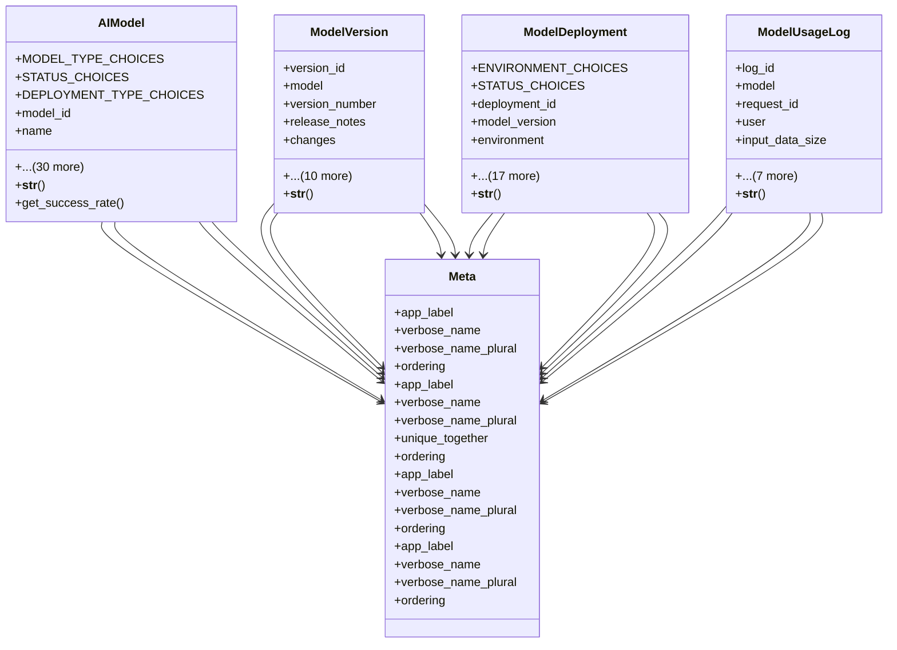

# ai_modules.ai_models.models

## Imports
- decimal
- django.conf
- django.db
- django.utils
- django.utils.translation
- uuid

## Classes
- AIModel
  - attr: `MODEL_TYPE_CHOICES`
  - attr: `STATUS_CHOICES`
  - attr: `DEPLOYMENT_TYPE_CHOICES`
  - attr: `model_id`
  - attr: `name`
  - attr: `description`
  - attr: `model_type`
  - attr: `status`
  - attr: `version`
  - attr: `previous_version`
  - attr: `training_data_size`
  - attr: `training_duration`
  - attr: `training_cost`
  - attr: `accuracy`
  - attr: `precision`
  - attr: `recall`
  - attr: `f1_score`
  - attr: `inference_time`
  - attr: `deployment_type`
  - attr: `deployment_url`
  - attr: `api_endpoint`
  - attr: `memory_requirements`
  - attr: `cpu_requirements`
  - attr: `gpu_requirements`
  - attr: `model_file_path`
  - attr: `config_file_path`
  - attr: `weights_file_path`
  - attr: `total_requests`
  - attr: `successful_requests`
  - attr: `average_response_time`
  - attr: `last_used`
  - attr: `created_by`
  - attr: `created_at`
  - attr: `updated_at`
  - attr: `deployed_at`
  - method: `__str__`
  - method: `get_success_rate`
- ModelVersion
  - attr: `version_id`
  - attr: `model`
  - attr: `version_number`
  - attr: `release_notes`
  - attr: `changes`
  - attr: `improvements`
  - attr: `bug_fixes`
  - attr: `performance_metrics`
  - attr: `benchmark_results`
  - attr: `model_file_size`
  - attr: `checksum`
  - attr: `is_stable`
  - attr: `is_deprecated`
  - attr: `released_at`
  - attr: `deprecated_at`
  - method: `__str__`
- ModelDeployment
  - attr: `ENVIRONMENT_CHOICES`
  - attr: `STATUS_CHOICES`
  - attr: `deployment_id`
  - attr: `model_version`
  - attr: `environment`
  - attr: `status`
  - attr: `deployment_config`
  - attr: `scaling_config`
  - attr: `service_name`
  - attr: `service_port`
  - attr: `health_check_url`
  - attr: `allocated_memory`
  - attr: `allocated_cpu`
  - attr: `allocated_gpu`
  - attr: `current_load`
  - attr: `peak_load`
  - attr: `uptime_percentage`
  - attr: `deployed_at`
  - attr: `last_health_check`
  - attr: `deployed_by`
  - attr: `created_at`
  - attr: `updated_at`
  - method: `__str__`
- ModelUsageLog
  - attr: `log_id`
  - attr: `model`
  - attr: `request_id`
  - attr: `user`
  - attr: `input_data_size`
  - attr: `output_data_size`
  - attr: `processing_time`
  - attr: `success`
  - attr: `error_message`
  - attr: `confidence_score`
  - attr: `metadata`
  - attr: `timestamp`
  - method: `__str__`
- Meta
  - attr: `app_label`
  - attr: `verbose_name`
  - attr: `verbose_name_plural`
  - attr: `ordering`
- Meta
  - attr: `app_label`
  - attr: `verbose_name`
  - attr: `verbose_name_plural`
  - attr: `unique_together`
  - attr: `ordering`
- Meta
  - attr: `app_label`
  - attr: `verbose_name`
  - attr: `verbose_name_plural`
  - attr: `ordering`
- Meta
  - attr: `app_label`
  - attr: `verbose_name`
  - attr: `verbose_name_plural`
  - attr: `ordering`

## Functions
- __str__
- get_success_rate
- __str__
- __str__
- __str__

## Class Diagram

