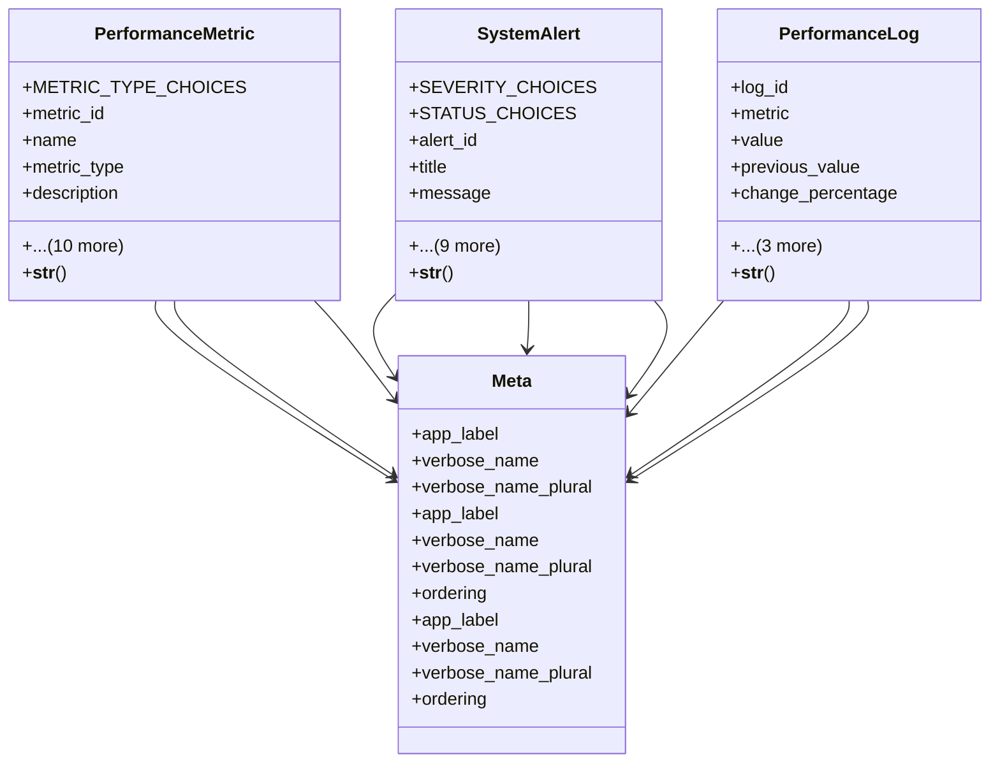

# ai_modules.ai_monitoring.models

## Imports
- django.conf
- django.db
- django.utils
- django.utils.translation
- uuid

## Classes
- PerformanceMetric
  - attr: `METRIC_TYPE_CHOICES`
  - attr: `metric_id`
  - attr: `name`
  - attr: `metric_type`
  - attr: `description`
  - attr: `current_value`
  - attr: `target_value`
  - attr: `threshold_min`
  - attr: `threshold_max`
  - attr: `agent_id`
  - attr: `module_name`
  - attr: `created_at`
  - attr: `updated_at`
  - attr: `last_measured`
  - attr: `is_active`
  - method: `__str__`
- SystemAlert
  - attr: `SEVERITY_CHOICES`
  - attr: `STATUS_CHOICES`
  - attr: `alert_id`
  - attr: `title`
  - attr: `message`
  - attr: `severity`
  - attr: `status`
  - attr: `source_type`
  - attr: `source_id`
  - attr: `triggered_at`
  - attr: `acknowledged_at`
  - attr: `resolved_at`
  - attr: `acknowledged_by`
  - attr: `resolved_by`
  - method: `__str__`
- PerformanceLog
  - attr: `log_id`
  - attr: `metric`
  - attr: `value`
  - attr: `previous_value`
  - attr: `change_percentage`
  - attr: `context_data`
  - attr: `measured_at`
  - attr: `notes`
  - method: `__str__`
- Meta
  - attr: `app_label`
  - attr: `verbose_name`
  - attr: `verbose_name_plural`
- Meta
  - attr: `app_label`
  - attr: `verbose_name`
  - attr: `verbose_name_plural`
  - attr: `ordering`
- Meta
  - attr: `app_label`
  - attr: `verbose_name`
  - attr: `verbose_name_plural`
  - attr: `ordering`

## Functions
- __str__
- __str__
- __str__

## Class Diagram

