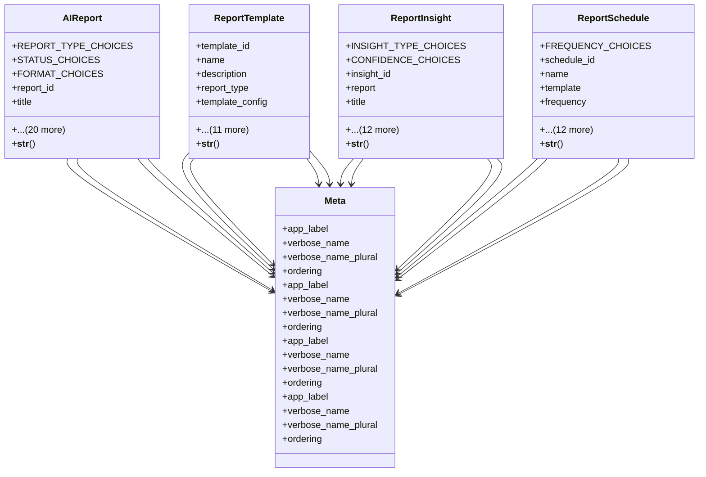

# ai_modules.ai_reports.models

## Imports
- django.conf
- django.db
- django.utils
- django.utils.translation
- uuid

## Classes
- AIReport
  - attr: `REPORT_TYPE_CHOICES`
  - attr: `STATUS_CHOICES`
  - attr: `FORMAT_CHOICES`
  - attr: `report_id`
  - attr: `title`
  - attr: `description`
  - attr: `report_type`
  - attr: `status`
  - attr: `start_date`
  - attr: `end_date`
  - attr: `filters`
  - attr: `criteria`
  - attr: `data_sources`
  - attr: `summary_data`
  - attr: `detailed_data`
  - attr: `output_format`
  - attr: `file_path`
  - attr: `file_size`
  - attr: `generation_time`
  - attr: `generated_by`
  - attr: `is_scheduled`
  - attr: `schedule_frequency`
  - attr: `next_generation`
  - attr: `created_at`
  - attr: `completed_at`
  - method: `__str__`
- ReportTemplate
  - attr: `template_id`
  - attr: `name`
  - attr: `description`
  - attr: `report_type`
  - attr: `template_config`
  - attr: `default_filters`
  - attr: `chart_configs`
  - attr: `layout_config`
  - attr: `style_config`
  - attr: `usage_count`
  - attr: `last_used`
  - attr: `created_by`
  - attr: `is_public`
  - attr: `is_active`
  - attr: `created_at`
  - attr: `updated_at`
  - method: `__str__`
- ReportInsight
  - attr: `INSIGHT_TYPE_CHOICES`
  - attr: `CONFIDENCE_CHOICES`
  - attr: `insight_id`
  - attr: `report`
  - attr: `title`
  - attr: `description`
  - attr: `insight_type`
  - attr: `supporting_data`
  - attr: `metrics`
  - attr: `confidence`
  - attr: `importance_score`
  - attr: `recommendations`
  - attr: `action_items`
  - attr: `discovered_at`
  - attr: `is_acknowledged`
  - attr: `acknowledged_by`
  - attr: `acknowledged_at`
  - method: `__str__`
- ReportSchedule
  - attr: `FREQUENCY_CHOICES`
  - attr: `schedule_id`
  - attr: `name`
  - attr: `template`
  - attr: `frequency`
  - attr: `custom_cron`
  - attr: `start_time`
  - attr: `timezone`
  - attr: `recipients`
  - attr: `email_subject`
  - attr: `email_body`
  - attr: `is_active`
  - attr: `last_run`
  - attr: `next_run`
  - attr: `created_by`
  - attr: `created_at`
  - attr: `updated_at`
  - method: `__str__`
- Meta
  - attr: `app_label`
  - attr: `verbose_name`
  - attr: `verbose_name_plural`
  - attr: `ordering`
- Meta
  - attr: `app_label`
  - attr: `verbose_name`
  - attr: `verbose_name_plural`
  - attr: `ordering`
- Meta
  - attr: `app_label`
  - attr: `verbose_name`
  - attr: `verbose_name_plural`
  - attr: `ordering`
- Meta
  - attr: `app_label`
  - attr: `verbose_name`
  - attr: `verbose_name_plural`
  - attr: `ordering`

## Functions
- __str__
- __str__
- __str__
- __str__

## Class Diagram

