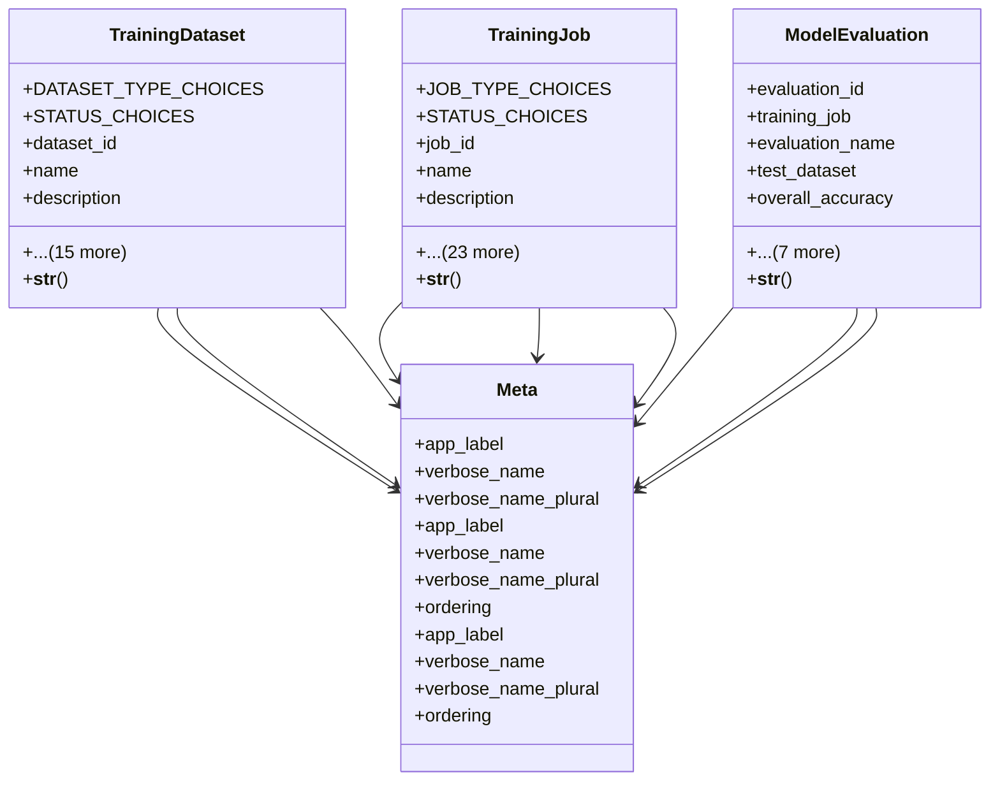

# ai_modules.ai_training.models

## Imports
- django.conf
- django.db
- django.utils
- django.utils.translation
- uuid

## Classes
- TrainingDataset
  - attr: `DATASET_TYPE_CHOICES`
  - attr: `STATUS_CHOICES`
  - attr: `dataset_id`
  - attr: `name`
  - attr: `description`
  - attr: `dataset_type`
  - attr: `status`
  - attr: `total_samples`
  - attr: `training_samples`
  - attr: `validation_samples`
  - attr: `test_samples`
  - attr: `quality_score`
  - attr: `completeness`
  - attr: `consistency`
  - attr: `data_path`
  - attr: `metadata_path`
  - attr: `created_by`
  - attr: `created_at`
  - attr: `updated_at`
  - attr: `last_processed`
  - method: `__str__`
- TrainingJob
  - attr: `JOB_TYPE_CHOICES`
  - attr: `STATUS_CHOICES`
  - attr: `job_id`
  - attr: `name`
  - attr: `description`
  - attr: `job_type`
  - attr: `status`
  - attr: `dataset`
  - attr: `model_name`
  - attr: `model_version`
  - attr: `hyperparameters`
  - attr: `training_config`
  - attr: `progress_percentage`
  - attr: `current_epoch`
  - attr: `total_epochs`
  - attr: `training_loss`
  - attr: `validation_loss`
  - attr: `training_accuracy`
  - attr: `validation_accuracy`
  - attr: `started_at`
  - attr: `completed_at`
  - attr: `estimated_completion`
  - attr: `gpu_usage`
  - attr: `memory_usage`
  - attr: `cpu_usage`
  - attr: `created_by`
  - attr: `created_at`
  - attr: `updated_at`
  - method: `__str__`
- ModelEvaluation
  - attr: `evaluation_id`
  - attr: `training_job`
  - attr: `evaluation_name`
  - attr: `test_dataset`
  - attr: `overall_accuracy`
  - attr: `precision`
  - attr: `recall`
  - attr: `f1_score`
  - attr: `detailed_results`
  - attr: `confusion_matrix`
  - attr: `evaluated_at`
  - attr: `notes`
  - method: `__str__`
- Meta
  - attr: `app_label`
  - attr: `verbose_name`
  - attr: `verbose_name_plural`
- Meta
  - attr: `app_label`
  - attr: `verbose_name`
  - attr: `verbose_name_plural`
  - attr: `ordering`
- Meta
  - attr: `app_label`
  - attr: `verbose_name`
  - attr: `verbose_name_plural`
  - attr: `ordering`

## Functions
- __str__
- __str__
- __str__

## Class Diagram

