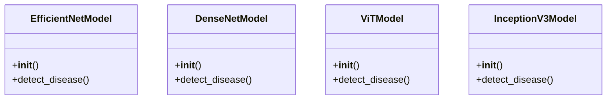

# ai_modules.models.additional_models

## Imports
- detection_models
- disease_mappings
- os
- random
- typing

## Classes
- EfficientNetModel
  - method: `__init__`
  - method: `detect_disease`
- DenseNetModel
  - method: `__init__`
  - method: `detect_disease`
- ViTModel
  - method: `__init__`
  - method: `detect_disease`
- InceptionV3Model
  - method: `__init__`
  - method: `detect_disease`

## Functions
- __init__
- detect_disease
- __init__
- detect_disease
- __init__
- detect_disease
- __init__
- detect_disease

## Module Variables
- `UNKNOWN_DISEASE_NAME`
- `UNKNOWN_DISEASE_SCIENTIFIC`
- `UNKNOWN_DISEASE_DESCRIPTION`
- `IMAGE_NOT_FOUND_ERROR`

## Class Diagram

