# ai_modules.models.detection_models

## Imports
- PIL
- disease_mappings
- json
- numpy
- os
- pydantic
- tensorflow
- time
- torch
- torchvision
- traceback
- typing
- ultralytics

## Classes
- TorchVisionClassificationModel
  - attr: `model_loader`
  - attr: `weights_loader`
  - method: `load_model_and_preprocessing`
  - method: `preprocess_image`
  - method: `_run_inference`
  - method: `_process_output`
- ResNet50Model
  - method: `__init__`
- MobileNetV3LargeModel
  - method: `__init__`
- KerasClassificationModel
  - attr: `target_size`
  - method: `load_model_and_preprocessing`
  - method: `preprocess_image`
  - method: `_run_inference`
  - method: `_process_output`
- SimpleKerasModel
  - method: `__init__`
- YOLOModel
  - method: `load_model_and_preprocessing`
  - method: `preprocess_image`
  - method: `_run_inference`
  - method: `_process_output`
- YOLOV8nModel
  - method: `__init__`
- DetectionModelBase
  - attr: `name`
  - attr: `description`
  - attr: `version`
  - attr: `model_type`
  - attr: `model_path`
  - attr: `model_instance`
  - attr: `transforms`
  - attr: `class_names`
- DetectionModelBase
  - method: `__init__`
- DummyModel
  - method: `load_model_and_preprocessing`
  - method: `_run_inference`
  - method: `_process_output`
- Config
  - attr: `arbitrary_types_allowed`

## Functions
- get_available_models
- get_model_instance
- load_model_and_preprocessing
- preprocess_image
- detect_disease
- _run_inference
- _process_output
- _fallback_detection
- _map_prediction_to_disease_info
- load_model_and_preprocessing
- preprocess_image
- _run_inference
- _process_output
- __init__
- __init__
- load_model_and_preprocessing
- preprocess_image
- _run_inference
- _process_output
- __init__
- load_model_and_preprocessing
- preprocess_image
- _run_inference
- _process_output
- __init__
- __init__
- load_model_and_preprocessing
- _run_inference
- _process_output

## Module Variables
- `AVAILABLE_MODELS`

## Class Diagram

```mermaid
classDiagram
    class TorchVisionClassificationModel {
        +model_loader
        +weights_loader
        +load_model_and_preprocessing()
        +preprocess_image()
        +_run_inference()
        +_process_output()
    }
    class ResNet50Model {
        +__init__()
    }
    class MobileNetV3LargeModel {
        +__init__()
    }
    class KerasClassificationModel {
        +target_size
        +load_model_and_preprocessing()
        +preprocess_image()
        +_run_inference()
        +_process_output()
    }
    class SimpleKerasModel {
        +__init__()
    }
    class YOLOModel {
        +load_model_and_preprocessing()
        +preprocess_image()
        +_run_inference()
        +_process_output()
    }
    class YOLOV8nModel {
        +__init__()
    }
    class DetectionModelBase {
        +name
        +description
        +version
        +model_type
        +model_path
        +... (3 more)
    }
    class DetectionModelBase {
        +__init__()
    }
    class DummyModel {
        +load_model_and_preprocessing()
        +_run_inference()
        +_process_output()
    }
    class Config {
        +arbitrary_types_allowed
    }
```

