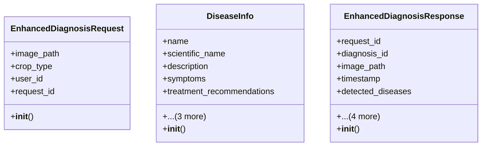

# ai_modules.models.enhanced_ai_models

## Imports
- additional_models
- datetime
- detection_models
- pydantic
- sys
- typing

## Classes
- EnhancedDiagnosisRequest
  - attr: `image_path`
  - attr: `crop_type`
  - attr: `user_id`
  - attr: `request_id`
- EnhancedDiagnosisRequest
  - method: `__init__`
- DiseaseInfo
  - attr: `name`
  - attr: `scientific_name`
  - attr: `description`
  - attr: `symptoms`
  - attr: `treatment_recommendations`
  - attr: `prevention_tips`
  - attr: `severity_level`
  - attr: `affected_parts`
- DiseaseInfo
  - method: `__init__`
- EnhancedDiagnosisResponse
  - attr: `request_id`
  - attr: `diagnosis_id`
  - attr: `image_path`
  - attr: `timestamp`
  - attr: `detected_diseases`
  - attr: `confidence_score`
  - attr: `processing_time_ms`
  - attr: `model_version`
  - attr: `additional_notes`
- EnhancedDiagnosisResponse
  - method: `__init__`

## Functions
- get_enhanced_models
- get_enhanced_model
- Field
- __init__
- __init__
- __init__

## Module Variables
- `_enhanced_models`

## Class Diagram

