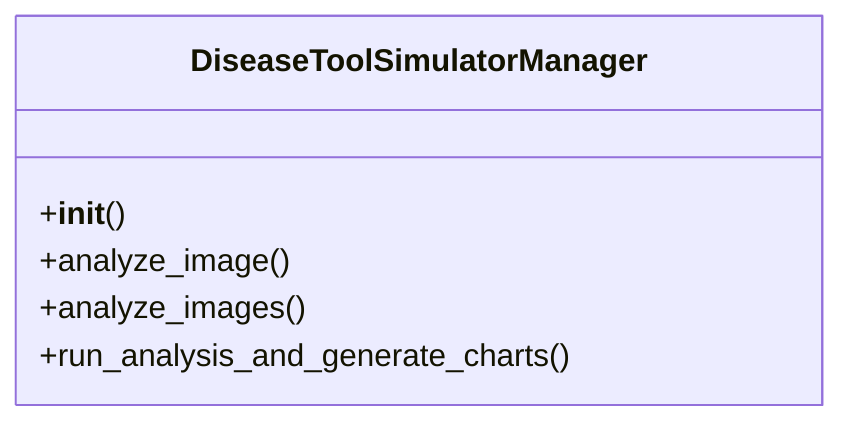

# ai_modules.models.new_ai_tools

## Imports
- json
- logging
- os
- simulated_tools.agrio_app_simulator
- simulated_tools.crop_health_simulator
- simulated_tools.plant_disease_classifier
- simulated_tools.plant_health_simulator
- simulated_tools.plantix_app_simulator
- simulated_tools.plantix_vision_simulator
- simulated_tools.plantvillage_nuru_simulator
- tqdm
- utils.chart_generator

## Classes
- DiseaseToolSimulatorManager
  - method: `__init__`
  - method: `analyze_image`
  - method: `analyze_images`
  - method: `run_analysis_and_generate_charts`

## Functions
- main
- __init__
- analyze_image
- analyze_images
- run_analysis_and_generate_charts
- tqdm

## Module Variables
- `logger`

## Class Diagram

