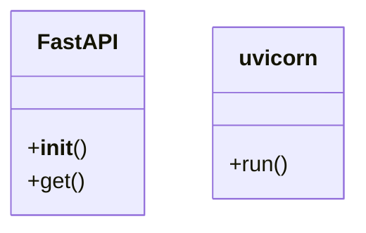

# ai_modules.service

## Imports
- fastapi
- logging
- os
- uvicorn

## Classes
- FastAPI
  - method: `__init__`
  - method: `get`
- uvicorn
  - method: `run`

## Functions
- root
- health_check
- list_models
- __init__
- get
- run
- decorator

## Module Variables
- `logger`
- `app`

## Class Diagram

