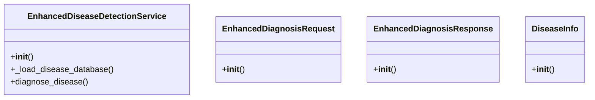

# ai_modules.services.enhanced_ai_services

## Imports
- ai_modules.models.enhanced_ai_models
- models.enhanced_ai_models
- os
- random
- time
- typing

## Classes
- EnhancedDiseaseDetectionService
  - method: `__init__`
  - method: `_load_disease_database`
  - method: `diagnose_disease`
- EnhancedDiagnosisRequest
  - method: `__init__`
- EnhancedDiagnosisResponse
  - method: `__init__`
- DiseaseInfo
  - method: `__init__`

## Functions
- __init__
- _load_disease_database
- diagnose_disease
- __init__
- __init__
- __init__

## Class Diagram

