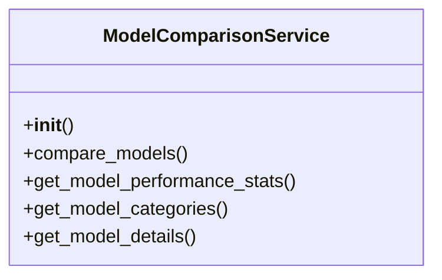

# ai_modules.services.model_comparison_service

## Imports
- datetime
- json
- models.detection_models
- os
- time
- typing
- uuid

## Classes
- ModelComparisonService
  - method: `__init__`
  - method: `compare_models`
  - method: `get_model_performance_stats`
  - method: `get_model_categories`
  - method: `get_model_details`

## Functions
- get_all_models
- __init__
- compare_models
- get_model_performance_stats
- get_model_categories
- get_model_details
- get_all_models

## Module Variables
- `model_comparison_service`

## Class Diagram

